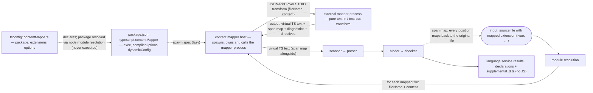
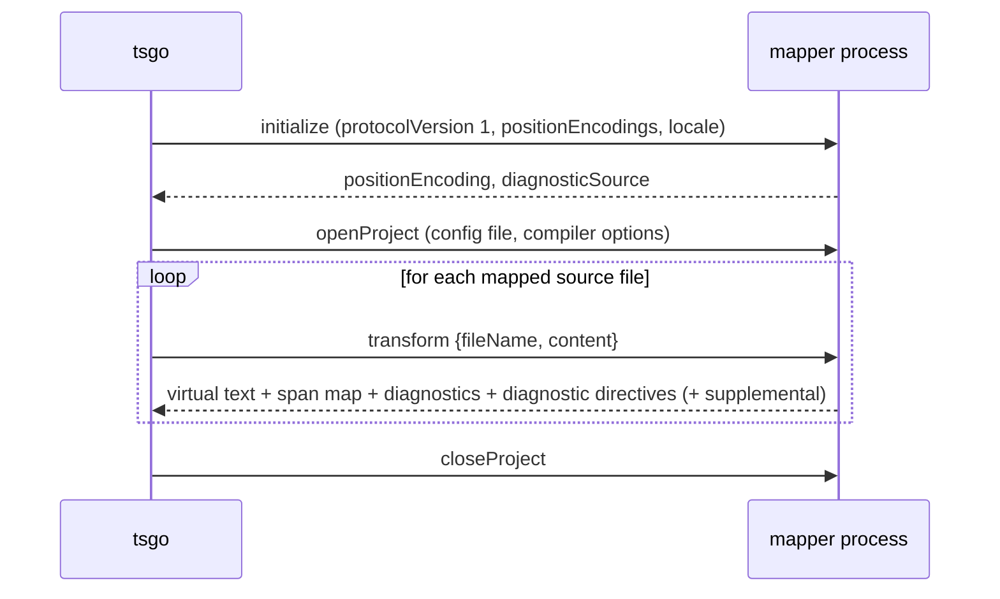
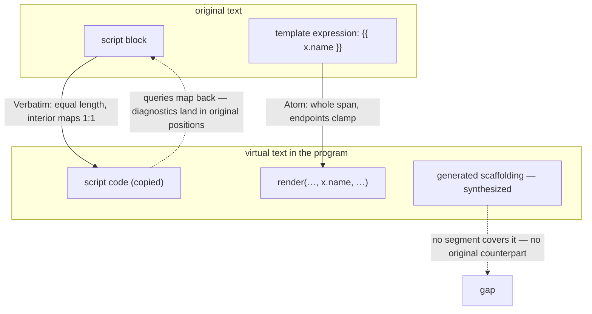
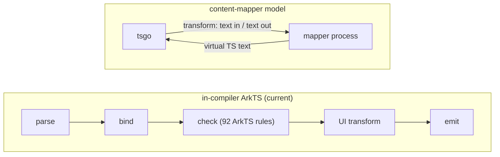

# Content Mappers (Upstream PR 4712) — Architecture Overview and ArkTS Implications

Upstream `microsoft/typescript-go` PR [#4712](https://github.com/microsoft/typescript-go/pull/4712) ("Content mappers", by andrewbranch, merged 2026-08-19T21:13Z via merge queue as commit `01b9e721f3d7f8037d700daff94f5808c1afb97e`) implements the content-mapper design discussed in the external-integration API design track (microsoft/TypeScript#63800). This document summarizes the mechanism for architects and assesses what it means for the tsgo-arkts port.

---

## Executive Summary

Content mappers are upstream's sanctioned extension mechanism for tsgo: a tsconfig-declared npm package transforms "unsupported" files (`.vue`, `.svelte`, `.mdx`, …) into virtual TypeScript with span-mapped positions (364 files, +21,267 / −1,282, merged into upstream main 2026-08-19; API protocol 5 → 7). Since the Go server cannot dynamically link third-party code (the old tsc plugin API is gone), integration happens through external child processes: tsgo spawns the mapper, sends it the file text, and parses the returned virtual TypeScript, mapping positions back through the span map.

**Verdict: content mappers are not a replacement for the in-compiler ArkTS pipeline — they are a source of reusable in-process mechanisms.**

1. **Do not re-architect ArkTS onto the mapper model.** It cuts exactly what the port is built on: bind/check semantics (a mapper receives only file text — checker parity is impossible), JS emit (upstream excludes mapped files deliberately, `emitter.go:477`), and the cross-file UI transform (ViewPU needs imported symbols). It also contradicts the core architecture principle of the project: ArkUI transforms are consolidated *inside* the tsgo process precisely to eliminate the AST-over-IPC bottleneck — an external mapper reintroduces it.
2. **Reusable mechanisms** (in-process, no architecture change): **span maps** for synthesized UI-transform regions (replacing `core.UndefinedTextRange()`); **`virtualFileName` / supplemental outputs** for canonical-vs-virtual file identity; **diagnostic directives** for diagnostics inside generated code.
3. **Optional experiment**: a mapper wrapper around the ported Go logic to measure how many ArkTS checks survive the mapper-diagnostics model. The ets-go precedent (Effect TypeScript) shows the real cost of that path: 4 compiler bug fixes + 1 API request. Research, not a plan.

**Bottom line:** content mappers do not change the ArkTS integration architecture; they are an upstream capability to absorb and a store of mechanisms that replace fork-specific workarounds.

---

## 1. Architecture



Solid edges carry data; dashed edges carry configuration and control.

### 1.1 Configuration surface

**tsconfig** — top-level array, alongside `files`/`include`/`exclude`, inherited through `extends` (`internal/tsoptions/tsconfigparsing.go:31,1169–1205`):

```jsonc
{
  "contentMappers": [
    { "package": "@vitejs/vue-mapper", "extensions": [".vue"], "options": { "…": "opaque to tsgo" } }
  ]
}
```

`Definition` = `{ package, extensions, options }` (`internal/contentmapper/contentmapper.go`). The mapper package is located by ordinary node module resolution from the config directory and **never executed during resolution**; its `package.json` provides the manifest (`internal/packagejson/packagejson.go:117–143`, `internal/tsoptions/contentmappers.go`):

```jsonc
// package.json of the mapper package
{
  "name": "@vitejs/vue-mapper",
  "version": "1.2.3",
  "typescript": {
    "contentMapper": {
      "exec": ["node", "bin/mapper.js"],   // non-empty array required
      "compilerOptions": ["jsx", "strict"], // subset of compiler options the transform depends on
      "dynamicConfig": false                 // mapper returns extra watched files / config identity
    }
  }
}
```

`name@version` forms the mapper **identity**; processes are consolidated by identity, so all projects sharing a mapper version share one process.

### 1.2 Process and protocol model

Per identity, tsgo lazily spawns the mapper (argv from `exec`, cwd = package directory) and talks **JSON-RPC over STDIO**, reusing `internal/ipc`. The content-mapper protocol has its **own version (1)** — separate from the API protocol (7). Four methods (`internal/contentmapper/hostimpl.go:39–42`):

- **`initialize`** — request: `{ protocolVersion: 1, positionEncodings: ["utf-8","utf-16"] }` (locale is also passed); response selects `positionEncoding` and a **`diagnosticSource`**: a prefix for every mapper-authored diagnostic code. The prefix must be non-empty, must not be `typescript`/`tsc`, and must not equal the mapped extension (so mapper diagnostics and tsgo diagnostics never collide, `hostimpl.go:1096–1125`).
- **`openProject` / `closeProject`** — project-scoped lifecycle; with `dynamicConfig: true` the mapper may return a `configIdentity` (changes invalidate cached transforms) and `watchedFiles` (fed into watch mode).
- **`transform`** — request `{ fileName, content }`; response:

```go
type Result struct {
    Text                 string                          // virtual TypeScript source
    VirtualExtension     string                          // how Text is parsed
    Diagnostics          []*ast.Diagnostic               // syntax errors in ORIGINAL positions
    Mappings             *spanmap.SpanMap                // virtual ↔ original
    DiagnosticDirectives []ast.MappedDiagnosticDirective // Ignore / Expect policies
    Supplemental         []MappedResult                  // extra unnamed virtual outputs
}
```

Protocol lifecycle:



`VirtualExtension` is restricted to `.js/.jsx/.mjs/.cjs/.ts/.tsx/.mts/.cts/.json` (`contentmapper.go`). Failure handling is explicit: transform errors become diagnostics; a mapper that fails 5 times is disabled for the rest of the run with a program-level diagnostic (`fileloader.go:32–34`); timings (spawn/initialize/openProject/closeProject/transform) are instrumented for `--stats`.

### 1.3 Span maps (`internal/spanmap`, +778)

Unlike source maps (point correspondences; "no origin" implicit), a span map records **explicit half-open segments** for the parts of the virtual text that correspond to the original. Any virtual position **not covered by a segment is synthesized** — content with no original counterpart. An empty map therefore means "fully synthesized output". All positions are absolute offsets (`core.TextPos`), matching the compiler's `TextRange` model.



- **Kind**: `Verbatim` (length-preserving, interior maps 1:1), `Atom` (maps a whole span; lengths may differ, interior clamps to endpoints — for renamed identifiers/short expressions), `Alias` (atom geometry + asserts both texts name the same logical entity; diagnostics may substitute the original name).
- **Feature**: a 20-bit mask per segment selecting which LS operations may use it — hover, signature help, completion, definition, type definition, implementation, references, document highlights, rename, call hierarchy, code actions, formatting, inlay hints, semantic tokens, folding, selection ranges, linked editing, auto-insert, document symbols, code lens. **Diagnostics deliberately bypass the mask** (they may not opt out) and text edits require exact `Verbatim` geometry.
- **Fidelity** of a query result: `Exact` (within one verbatim segment — safe for edits written back to the original), `Atom`, `Approximate` (crossed boundaries), `None` (synthesized gap). Bidirectional queries (`VirtualToOriginal*` and `OriginalToVirtual*`) plus `Validate()`.

### 1.4 Program integration

`fileloader.go` folds the mapper extensions into supported extensions and into the **module resolver** (a `.vue` import resolves like a module); on load, files with mapped extensions are transformed before parsing, with parse-cache keys that preserve the mapper context (`ContentMapperParseOptions`, `fileloader.go:89–98`). Mapper-authored syntax diagnostics and the program's own diagnostics are aggregated; **diagnostic directives** (`Ignore`/`Expect` per virtual range, with an `unusedCode` for unsatisfied expectations) let a mapper suppress or require specific tsgo diagnostics inside synthesized regions — e.g. Vue's `expect-error` in template expressions.

### 1.5 Emit

Deliberate asymmetry (`internal/compiler/emitter.go:477–481`): **content-mapped files are not emitted to JS** — runtime output is owned by the mapper or the build tool. **Declaration emit is supported** (`App.d.svelte.ts`-style canonical names); declaration *maps* are disabled because mapped positions would point into in-memory text (`emitter.go:227–230`, with a comment reserving span-map double-mapping as future work). **Supplemental outputs** (e.g. per-module generated declarations) get compiler-assigned numbered `.d.ts` names, with collision detection.

### 1.6 Incremental builds and watch

`TransformIdentity` — `xxh3(identity ‖ mapper options ‖ declared compiler options)` (`contentmapper.go`) — is folded into cache keys and `.tsbuildinfo`, so a mapper-version or relevant-option change invalidates exactly the affected transforms. Build mode propagates mapper failures into build exit status; `dynamicConfig`/`watchedFiles` integrate with `--watch` and `--build --watch`; process lifetimes are tied to project sessions.

### 1.7 Security

Content mappers are **arbitrary code execution by design** (they run from the project's `node_modules`), so they are double-gated: the compiler option `RunExternalCode` (`internal/execute/tsc/compile.go:86–91`) — without it `NewContentMapperHost` returns nil and **no mapped files load at all** — and, on the editor side, VS Code passes `runExternalCode` only in trusted workspaces (`js/ts.contentMappers.enabled`, experimental, default true).

### 1.8 LSP and API surface

The server registers **per-feature dynamic capabilities** for mapped documents — the same 20-feature matrix as the span-map `Feature` mask in §1.3, plus document lifecycle (did-open/change/close) and diagnostics (`lsp/server.go:324–347`); every LS feature maps its results through the span map. The extension API adds `registerContentMappers` (`_extension/src/contentMapperContributions.ts`), including contributions for **inferred projects**. API protocol goes 5 → 7; `SourceFile` gains `originalText`, `spanMap`, `contentMapper`, `virtualFileName`, `diagnosticDirectives`, `supplementalSourceFileNames`, `canonicalSourceFileName`.

---

## 2. Assessment for the tsgo-arkts Port

### 2.1 Content mappers are NOT a replacement for the in-compiler ArkTS pipeline

Three structural reasons, plus one architectural-principle reason:



Symbols, types, and check results exist only inside the program — they never cross the mapper boundary.

1. **No semantics across the boundary.** `transform` receives only `{fileName, content}` and returns text. The ArkTS UI transform (ViewPU generation in `internal/transformers/arktsuitransforms/`) consumes bind/check information — decorator semantics, imported symbols, struct constraints, `$$` bindings — that exists only inside the program. A mapper cannot reproduce it.
2. **No checker parity.** Mapper diagnostics are positioned syntax errors; ArkTS type rules (no-`any`, struct rules, Sendable constraints — the 92-rule linter unified in the checker) require type information. A mapper could only emit them by embedding the entire old ArkTS checker — the very fork the port retires.
3. **Emit is excluded upstream on purpose.** Mapped files do not emit JS. The hvigor integration is built on tsgo's own emit (`.ets` → JS + sourcemaps → es2abc bookkeeping in `internal/buildapi/`); a mapper path would hand emit back to an external tool, i.e. regress to the ets2bundle model.
4. **Architecture-principle conflict.** The project's core architecture consolidates ArkUI AST transforms **inside the tsgo process** specifically to eliminate the cross-process bottleneck (AST over IPC). An external content mapper doing ArkTS transforms is exactly that bottleneck reintroduced: re-architecting the build path around content mappers would invert a deliberate architectural decision.

### 2.2 Upstream mechanisms reusable in the fork

These are in-process compiler mechanisms — no architecture change required — that directly replace current fork-specific workarounds and shrink the diff against upstream:

- **Span maps for synthesized UI-transform regions.** Generated nodes today get `core.UndefinedTextRange()` (`internal/transformers/arktsuitransforms/component.go:1008`, `arkts_normalizedurl.go:66,74,104`). Span maps make "this region is synthesized" a first-class, queryable property, with per-feature participation — and give declaration diagnostics/positions a principled home (upstream itself reserves span-map double-mapping for declaration maps as future work, `emitter.go:227–230`).
- **`virtualFileName` / `canonicalSourceFileName` / supplemental outputs** instead of the bespoke virtual-name rename layer in `internal/buildapi/arktsmanifest.go:26–28,92–96,159–166` (which currently renames emitted `.ets` JS to `.ts` names on disk to imitate the reference toolchain's filesInfo naming). Upstream now formalizes canonical-vs-virtual file identity; the es2abc bookkeeping can reuse it.
- **Diagnostic directives** instead of ad-hoc suppression around generated declarations — cf. the lookup guard at `internal/binder/nameresolver.go:173–179` ("Generated declarations (e.g. ArkTS UI transform output) have no symbol").
- **`contentMapperExtensions` seam for `.ets` inclusion** — upstream now has an official mechanism for "extra extensions in the program"; where possible, the fork's `.ets` inclusion in `fileloader.go` should route through the same seam rather than parallel patches.

### 2.3 Optional research experiment (explicitly NOT a build-path plan)

A cheap experiment to inform long-term fork-minimization: package the already-ported Go ArkTS logic as a separate binary behind a thin mapper, and measure how many ArkTS-specific checks survive the mapper-diagnostics model. If most do, a *hybrid* becomes thinkable — mapper for syntax/editor, fork reduced to checker hooks only. If not (expected), the result still documents precisely why in-compiler integration is required. **The seam is validated by real integrations**: a Vue mapper built from `@vue/language-core` matches `vue-tsc` on 210 of 222 fixtures, and the independent [ets-go](https://github.com/mikearnaldi/ets-go) experiment (Effect TypeScript) is exactly this shape — its cost was 4 upstream bug fixes plus 1 API request.

---

## 3. References

- PR: <https://github.com/microsoft/typescript-go/pull/4712> (merged `01b9e721f3d7f8037d700daff94f5808c1afb97e`, 2026-08-19)
- Design track: <https://github.com/microsoft/TypeScript/issues/63800>
- Independent dialect integration experiments: <https://github.com/mikearnaldi/ets-go> (Effect TS; 4 bug-fix patches + 1 API request folded into the PR), Vue mapper validation (210/222 `vue-tsc`-identical fixtures)
- Upstream code: `internal/spanmap/spanmap.go`, `internal/contentmapper/{contentmapper,host,hostimpl,transform}.go`, `internal/compiler/{fileloader,emitter,program}.go`, `internal/lsp/server.go`, `internal/api/encoder/encoder.go`
- Fork code: `internal/compiler/{fileloader,emitter}.go`, `internal/transformers/arktsuitransforms/*`, `internal/buildapi/{session,arktsmanifest}.go`, `internal/binder/nameresolver.go`, `internal/api/encoder/encoder.go`
