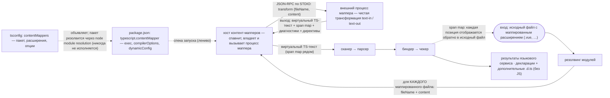
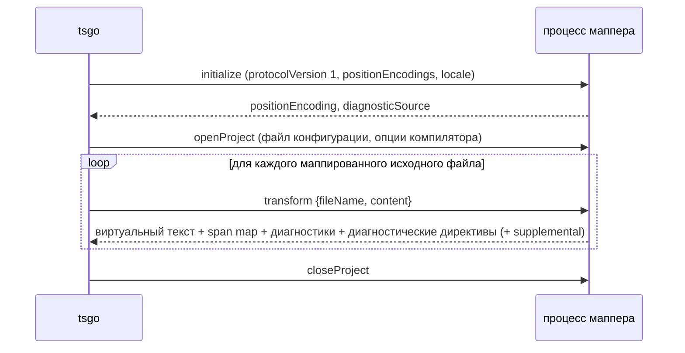
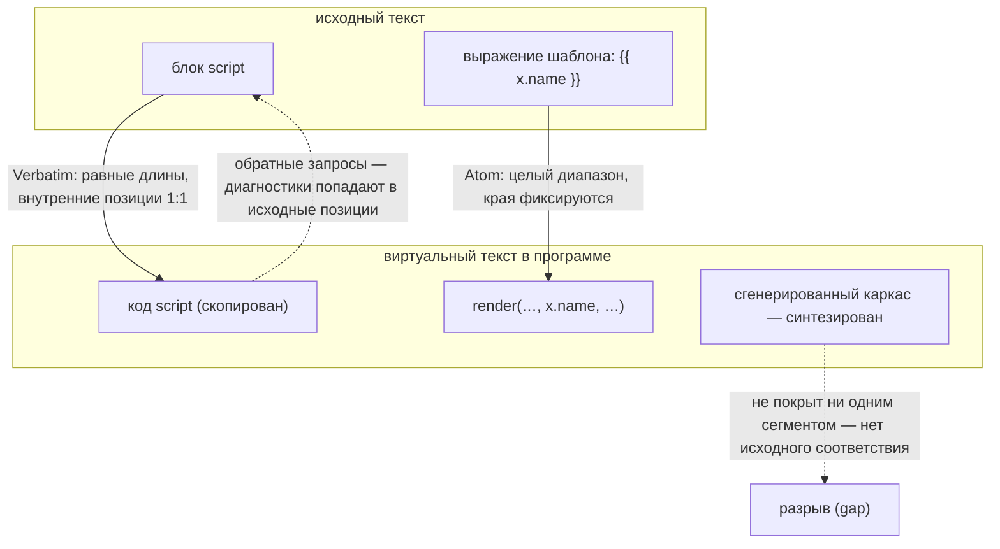
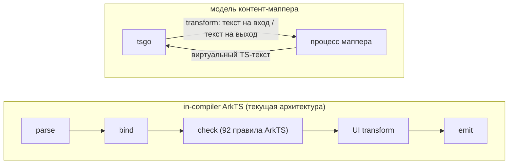

# Content Mappers (Upstream PR 4712) — обзор архитектуры и следствия для ArkTS

Upstream PR [microsoft/typescript-go #4712](https://github.com/microsoft/typescript-go/pull/4712) («Content mappers», автор andrewbranch, влит 2026-08-19T21:13Z через merge queue, коммит `01b9e721f3d7f8037d700daff94f5808c1afb97e`) реализует дизайн контент-мапперов, обсуждавшийся в треке API внешних интеграций (microsoft/TypeScript#63800). Документ объясняет механизм для архитекторов и оценивает его значение для порта tsgo-arkts.

---

## Executive Summary (Резюме)

Контент-мапперы — санкционированный upstream-механизм расширения tsgo: npm-пакет, объявленный в tsconfig, превращает «неподдерживаемые» файлы (`.vue`, `.svelte`, `.mdx`, …) в виртуальный TypeScript с отображением позиций через span map (364 файла, +21 267 / −1 282, влито в upstream main 2026-08-19; API-протокол 5 → 7). Поскольку Go-сервер не может динамически линковать сторонний код (прежнего plugin API tsc больше нет), интеграция происходит через внешние дочерние процессы: tsgo спавнит маппер, передаёт ему текст файла и парсит возвращённый виртуальный TypeScript, отображая позиции обратно через span map.

**Вердикт: контент-мапперы — не замена in-compiler конвейеру ArkTS; это источник переиспользуемых внутрипроцессных механизмов.**

1. **Не перестраивать ArkTS на модель мапперов.** Она отрезает ровно то, на чём построен порт: семантику bind/check (маппер получает только текст файла — checker parity невозможна), JS-эмит (upstream намеренно исключает маппированные файлы, `emitter.go:477`) и межфайловый UI-transform (ViewPU нужны импортированные символы). Это противоречит и базовому архитектурному принципу проекта: ArkUI-трансформации консолидированы *внутри* процесса tsgo именно ради устранения узкого места AST-over-IPC — внешний маппер возвращает это узкое место.
2. **Переиспользуемые механизмы** (внутри процесса, без изменения архитектуры): **span maps** для синтезированных регионов UI-transform'а (замена `core.UndefinedTextRange()`); **`virtualFileName` / supplemental outputs** для идентичности канонический-против-виртуального файла; **diagnostic directives** для диагностик внутри сгенерированного кода.
3. **Опциональный эксперимент**: обёртка-маппер над уже портированной Go-логикой, чтобы измерить, сколько ArkTS-проверок выживает в модели mapper-диагностик. Прецедент ets-go (Effect TypeScript) показывает реальную цену такого пути: 4 багфикса компилятора + 1 запрос нового API. Это исследование, не план.

**Итог одной строкой:** контент-мапперы не меняют архитектуру интеграции ArkTS; это upstream-возможность, которую нужно переварить, и склад механизмов, заменяющих форк-специфичные обходные решения.

---

## 1. Архитектура



Сплошные рёбра переносят данные; пунктирные — конфигурацию и управление.

### 1.1 Конфигурационная поверхность

**tsconfig** — массив верхнего уровня, наравне с `files`/`include`/`exclude`, наследуется через `extends` (`internal/tsoptions/tsconfigparsing.go:31,1169–1205`):

```jsonc
{
  "contentMappers": [
    { "package": "@vitejs/vue-mapper", "extensions": [".vue"], "options": { "…": "непрозрачно для tsgo" } }
  ]
}
```

`Definition` = `{ package, extensions, options }` (`internal/contentmapper/contentmapper.go`). Пакет маппера находится обычным node module resolution из директории конфига и **никогда не исполняется во время резолвинга**; его `package.json` даёт манифест (`internal/packagejson/packagejson.go:117–143`, `internal/tsoptions/contentmappers.go`):

```jsonc
// package.json пакета-маппера
{
  "name": "@vitejs/vue-mapper",
  "version": "1.2.3",
  "typescript": {
    "contentMapper": {
      "exec": ["node", "bin/mapper.js"],    // обязателен непустой массив
      "compilerOptions": ["jsx", "strict"], // подмножество опций компилятора, от которых зависит transform
      "dynamicConfig": false                 // маппер возвращает доп. watched-файлы / идентичность конфига
    }
  }
}
```

`name@version` образует **идентичность** маппера; процессы консолидируются по идентичности, так что все проекты, использующие одну версию маппера, делят один процесс.

### 1.2 Процессная и протокольная модель

По идентичности tsgo лениво спавнит маппер (argv из `exec`, cwd = директория пакета) и общается с ним **JSON-RPC по STDIO**, переиспользуя `internal/ipc`. У протокола контент-мапперов **своя версия (1)** — отдельная от API-протокола (7). Четыре метода (`internal/contentmapper/hostimpl.go:39–42`):

- **`initialize`** — запрос: `{ protocolVersion: 1, positionEncodings: ["utf-8","utf-16"] }` (также передаётся locale); ответ выбирает `positionEncoding` и **`diagnosticSource`**: префикс каждого диагностического кода, порождённого маппером. Префикс обязан быть непустым, не может быть `typescript`/`tsc` и не может совпадать с маппированным расширением (чтобы диагностики маппера и tsgo никогда не пересекались, `hostimpl.go:1096–1125`).
- **`openProject` / `closeProject`** — жизненный цикл на уровне проекта; при `dynamicConfig: true` маппер может вернуть `configIdentity` (изменение инвалидирует закешированные трансформации) и `watchedFiles` (попадают в watch-режим).
- **`transform`** — запрос `{ fileName, content }`; ответ:

```go
type Result struct {
    Text                 string                          // виртуальный исходный код TypeScript
    VirtualExtension     string                          // определяет, как парсить Text
    Diagnostics          []*ast.Diagnostic               // синтаксические ошибки в ИСХОДНЫХ позициях
    Mappings             *spanmap.SpanMap                // виртуальный ↔ исходный
    DiagnosticDirectives []ast.MappedDiagnosticDirective // политики Ignore / Expect
    Supplemental         []MappedResult                  // дополнительные безымянные виртуальные выводы
}
```

Жизненный цикл протокола:



`VirtualExtension` ограничен набором `.js/.jsx/.mjs/.cjs/.ts/.tsx/.mts/.cts/.json` (`contentmapper.go`). Обработка ошибок явная: ошибки transform становятся диагностиками; маппер, упавший 5 раз, отключается до конца запуска с диагностикой уровня программы (`fileloader.go:32–34`); тайминги (spawn/initialize/openProject/closeProject/transform) инструментированы для `--stats`.

### 1.3 Span maps (`internal/spanmap`, +778)

В отличие от source maps (точечные соответствия; «нет источника» подразумевается неявно), span map хранит **явные полуоткрытые сегменты** для частей виртуального текста, соответствующих оригиналу. Любая виртуальная позиция, **не покрытая сегментом, считается синтезированной** — контент без аналога в оригинале. Пустая карта, таким образом, означает «полностью синтезированный вывод». Все позиции — абсолютные смещения (`core.TextPos`), как в модели `TextRange` компилятора.



- **Kind**: `Verbatim` (сохраняет длину, внутренние позиции 1:1), `Atom` (отображает диапазон целиком; длины могут различаться, внутренние позиции прижимаются к краям — для переименованных идентификаторов и коротких выражений), `Alias` (геометрия atom + утверждение, что оба текста называют одну логическую сущность; диагностики могут подставлять исходное имя).
- **Feature**: 20-битная маска на сегмент, выбирающая, каким LS-операциям сегмент доступен — hover, signature help, completion, definition, type definition, implementation, references, document highlights, rename, call hierarchy, code actions, formatting, inlay hints, semantic tokens, folding, selection ranges, linked editing, auto-insert, document symbols, code lens. **Диагностики намеренно обходят маску** (отключиться от них нельзя), а правки текста требуют точной геометрии `Verbatim`.
- **Fidelity** результата запроса: `Exact` (внутри одного verbatim-сегмента — безопасно для правок, записываемых обратно в оригинал), `Atom`, `Approximate` (пересёк границы сегментов), `None` (синтезированный разрыв). Двунаправленные запросы (`VirtualToOriginal*` и `OriginalToVirtual*`) плюс `Validate()`.

### 1.4 Интеграция в программу

`fileloader.go` добавляет расширения маппера в поддерживаемые расширения и в **резолвер модулей** (импорт `.vue` резолвится как модуль); при загрузке файлы с маппированными расширениями трансформируются до парсинга, ключи parse-кэша сохраняют контекст маппера (`ContentMapperParseOptions`, `fileloader.go:89–98`). Синтаксические диагностики маппера и собственные диагностики программы агрегируются; **диагностические директивы** (`Ignore`/`Expect` на виртуальный диапазон, с `unusedCode` для неудовлетворённых ожиданий) позволяют мапперу подавлять или требовать конкретные диагностики tsgo внутри синтезированных регионов — например, vue-шный `expect-error` в выражениях шаблона.

### 1.5 Эмит

Намеренная асимметрия (`internal/compiler/emitter.go:477–481`): **маппированные файлы не эмитятся в JS** — рантайм-вывод принадлежит мапперу или сборочному инструменту. **Эмит деклараций поддерживается** (канонические имена в стиле `App.d.svelte.ts`); карты деклараций отключены, потому что маппированные позиции указывали бы в текст, существующий только в памяти (`emitter.go:227–230`, в комментарии зарезервирован двойной маппинг через span map как будущая работа). **Supplemental outputs** (например, сгенерированные декларации на модуль) получают назначенные компилятором номера `.d.ts`, с детекцией коллизий.

### 1.6 Инкрементальные сборки и watch

`TransformIdentity` — `xxh3(идентичность ‖ опции маппера ‖ объявленные опции компилятора)` (`contentmapper.go`) — попадает в ключи кэша и `.tsbuildinfo`, так что смена версии маппера или релевантной опции инвалидирует ровно затронутые трансформации. Сборочный режим протаскивает сбои маппера в статус выхода сборки; `dynamicConfig`/`watchedFiles` интегрируются с `--watch` и `--build --watch`; время жизни процессов привязано к сессиям проекта.

### 1.7 Безопасность

Контент-мапперы — это **произвольное исполнение кода по дизайну** (они запускаются из `node_modules` проекта), поэтому двойной гейт: опция компилятора `RunExternalCode` (`internal/execute/tsc/compile.go:86–91`) — без неё `NewContentMapperHost` возвращает nil и **маппированные файлы не загружаются вообще** — и, на стороне редактора, VS Code передаёт `runExternalCode` только в доверенных workspace (`js/ts.contentMappers.enabled`, экспериментально, по умолчанию true).

### 1.8 LSP и поверхность API

Сервер регистрирует **динамические возможности по каждой фиче** для маппированных документов — та же матрица из 20 фич, что и маска `Feature` span map в §1.3, плюс жизненный цикл документов (did-open/change/close) и диагностики (`lsp/server.go:324–347`); каждая LS-фича отображает свои результаты через span map. Расширенный API добавляет `registerContentMappers` (`_extension/src/contentMapperContributions.ts`), включая вклад для **inferred projects**. API-протокол поднят 5 → 7; `SourceFile` получает `originalText`, `spanMap`, `contentMapper`, `virtualFileName`, `diagnosticDirectives`, `supplementalSourceFileNames`, `canonicalSourceFileName`.

---

## 2. Оценка для порта tsgo-arkts

### 2.1 Контент-мапперы — НЕ замена in-compiler конвейеру ArkTS

Три структурные причины плюс одна причина архитектурного принципа:



Символы, типы и результаты проверки существуют только внутри программы — через границу маппера они не проходят.

1. **Семантика не пересекает границу.** `transform` получает только `{fileName, content}` и возвращает текст. ArkTS UI-transform (генерация ViewPU в `internal/transformers/arktsuitransforms/`) потребляет bind/check-информацию — семантику декораторов, импортированные символы, ограничения struct, `$$`-биндинги — которая существует только внутри программы. Маппер не может её воспроизвести.
2. **Нет checker parity.** Диагностики маппера — это позиционированные синтаксические ошибки; типовые правила ArkTS (no-`any`, правила struct, ограничения Sendable — 92 правила линтера, унифицированные в чекере) требуют информации о типах. Маппер смог бы выдавать их, только встроив в себя весь старый ArkTS-чекер — ровно тот форк, который порт выводит из эксплуатации.
3. **Эмит исключён upstream намеренно.** Маппированные файлы не эмитят JS. Интеграция с hvigor построена на собственном эмите tsgo (`.ets` → JS + sourcemaps → учёт es2abc в `internal/buildapi/`); путь через маппер вернул бы эмит внешнему инструменту, то есть откатил бы к модели ets2bundle.
4. **Конфликт с архитектурным принципом.** Базовая архитектура проекта консолидирует ArkUI AST-трансформации **внутри процесса tsgo** именно ради устранения межпроцессного узкого места (AST over IPC). Внешний контент-маппер, выполняющий ArkTS-трансформации, — это ровно то узкое место, возвращённое обратно: перестройка сборочного пути вокруг контент-мапперов инвертировала бы осознанное архитектурное решение.

### 2.2 Механизмы upstream, переиспользуемые в форке

Это внутрипроцессные механизмы компилятора — без изменения архитектуры — которые напрямую заменяют текущие форк-специфичные обходные решения и сокращают дифф с upstream:

- **Span maps для синтезированных регионов UI-transform'а.** Сгенерированные узлы сегодня получают `core.UndefinedTextRange()` (`internal/transformers/arktsuitransforms/component.go:1008`, `arkts_normalizedurl.go:66,74,104`). Span maps делают «этот регион синтезирован» свойством первого класса, доступным для запросов, с участием по каждой фиче — и дают диагностикам и позициям деклараций принципиальный дом (сам upstream резервирует двойной маппинг span map для карт деклараций как будущую работу, `emitter.go:227–230`).
- **`virtualFileName` / `canonicalSourceFileName` / supplemental outputs** вместо самодельного слоя переименования виртуальных имён в `internal/buildapi/arktsmanifest.go:26–28,92–96,159–166` (который сейчас переименовывает на диске JS эмитированных `.ets` в имена `.ts`, имитируя naming filesInfo референсного тулчейна). Upstream теперь формализует каноническую-против-виртуальной идентичность файла; учёт es2abc может это переиспользовать.
- **Diagnostic directives** вместо ad-hoc подавления вокруг сгенерированных деклараций — ср. guard поиска в `internal/binder/nameresolver.go:173–179` («У сгенерированных деклараций (например, вывода ArkTS UI transform) нет символа»).
- **Слой `contentMapperExtensions` для включения `.ets`** — у upstream теперь есть официальный механизм «дополнительных расширений в программе»; где возможно, включение `.ets` в `fileloader.go` должно идти через тот же слой, а не параллельными патчами.

### 2.3 Опциональный исследовательский эксперимент (явно НЕ план сборочного пути)

Дешёвый эксперимент для долгосрочной минимизации форка: упаковать уже портированную Go-логику ArkTS в отдельный бинарь за тонким маппером и измерить, сколько ArkTS-специфичных проверок выживает в модели mapper-диагностик. Если большинство — становится мыслим *гибрид*: маппер для синтаксиса/редактора, форк сокращается до хуков чекера. Если нет (ожидаемо), результат всё равно точно документирует, почему нужна in-compiler интеграция. **Шов проверен реальными интеграциями**: Vue-маппер, собранный из `@vue/language-core`, совпадает с `vue-tsc` на 210 из 222 фикстур, а независимый эксперимент [ets-go](https://github.com/mikearnaldi/ets-go) (Effect TypeScript) — ровно эта форма; его цена составила 4 upstream-багфикса плюс 1 запрос API.

---

## 3. Ссылки

- PR: <https://github.com/microsoft/typescript-go/pull/4712> (влит `01b9e721f3d7f8037d700daff94f5808c1afb97e`, 2026-08-19)
- Трек дизайна: <https://github.com/microsoft/TypeScript/issues/63800>
- Независимые эксперименты по интеграции диалектов: <https://github.com/mikearnaldi/ets-go> (Effect TS; 4 багфикс-патча + 1 запрос API, влитые в PR), валидация Vue-маппером (210/222 фикстур идентичны `vue-tsc`)
- Код upstream: `internal/spanmap/spanmap.go`, `internal/contentmapper/{contentmapper,host,hostimpl,transform}.go`, `internal/compiler/{fileloader,emitter,program}.go`, `internal/lsp/server.go`, `internal/api/encoder/encoder.go`
- Код форка: `internal/compiler/{fileloader,emitter}.go`, `internal/transformers/arktsuitransforms/*`, `internal/buildapi/{session,arktsmanifest}.go`, `internal/binder/nameresolver.go`, `internal/api/encoder/encoder.go`
