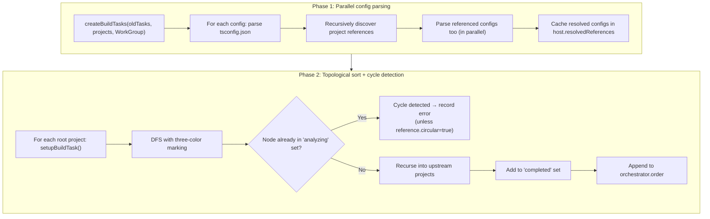
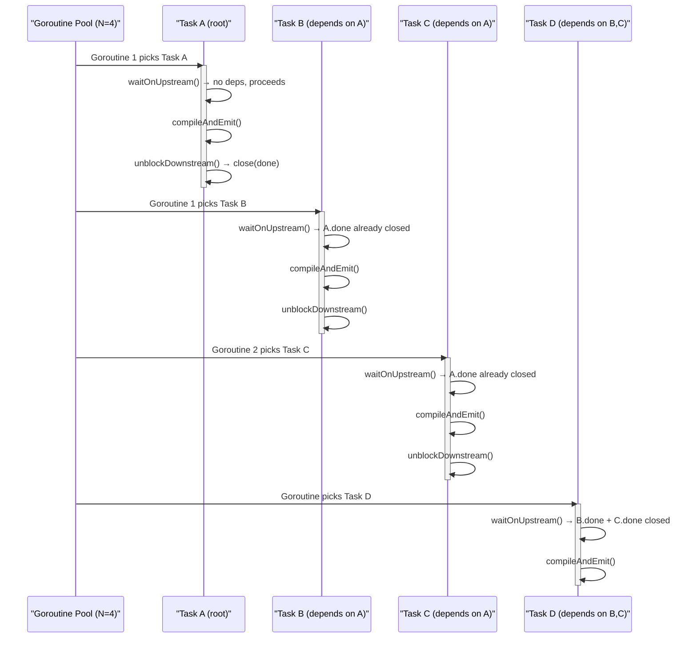
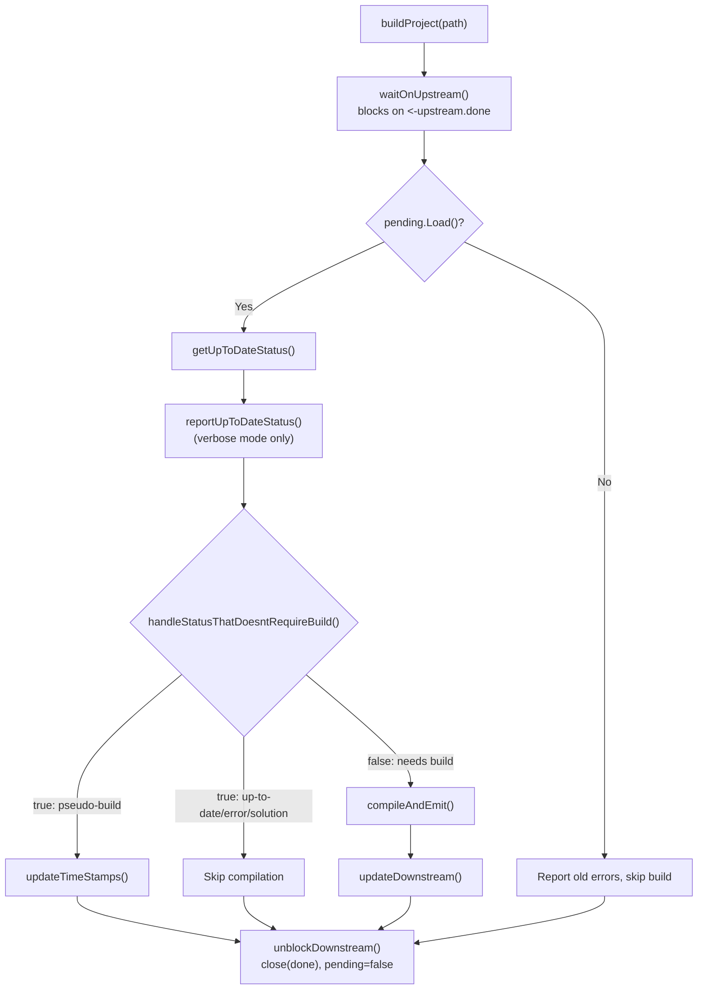
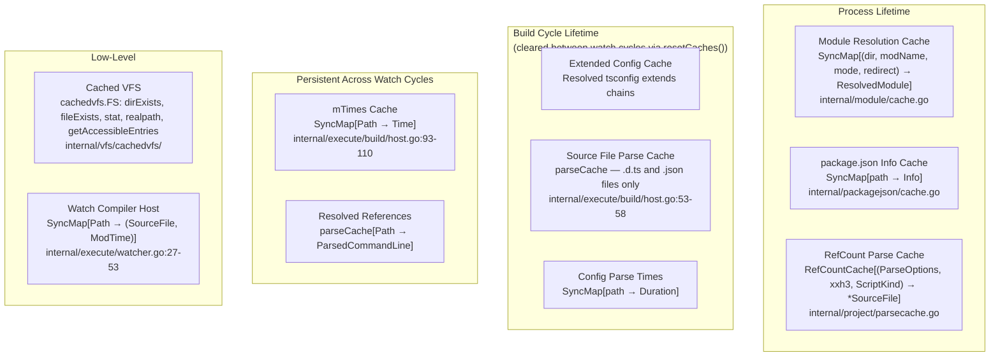
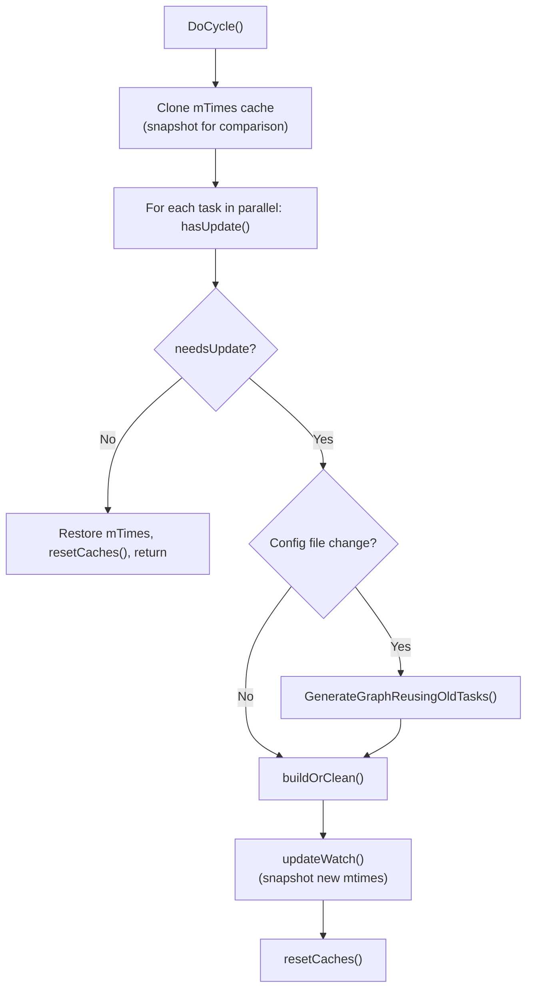

# tsgo Build System Design (`tsc --build`)

---

## 1. High-Level Overview

tsgo provides a **multi-project build orchestrator** for TypeScript monorepos. It is the implementation of `tsc --build` (a.k.a. "project references" mode). Given one or more `tsconfig.json` files, the orchestrator:

1. **Resolves the project graph** — parses all configs, discovers `references`, builds a DAG
2. **Checks up-to-date status** — compares input/output timestamps, `.tsbuildinfo` content hashes, and upstream project states to decide what needs rebuilding
3. **Builds in parallel** — schedules projects topologically, with N concurrent workers
4. **Writes incremental state** — emits `.tsbuildinfo` files enabling future incremental builds
5. **Supports watch mode** — polls for file changes, incrementally rebuilds only affected projects

```
User invokes:  tsgo --build tsconfig.json

┌──────────────────────────────────────────────────────────────────┐
│                     Orchestrator.Start()                         │
│                                                                  │
│  GenerateGraph()            buildOrClean()         Watch()       │
│  ┌────────────────┐       ┌────────────────┐     ┌────────────┐  │
│  │ Parse configs  │       │ Topological    │     │ Poll mtimes│  │
│  │ in parallel    │  ──►  │ parallel build │──► │ Rebuild    │  │
│  │ DFS topo sort  │       │ Report results │     │ changed    │  │
│  │ Detect cycles  │       │                │     │ projects   │  │
│  └────────────────┘       └────────────────┘     └────────────┘  │
└──────────────────────────────────────────────────────────────────┘
```

**Entry point** — `internal/execute/tsc.go:52-63`:

```go
func CommandLine(sys tsc.System, commandLineArgs []string, testing tsc.CommandLineTesting) tsc.CommandLineResult {
    if len(commandLineArgs) > 0 {
        switch strings.ToLower(commandLineArgs[0]) {
        case "-b", "--b", "-build", "--build":
            return tscBuildCompilation(sys, tsoptions.ParseBuildCommandLine(commandLineArgs, sys), testing)
        }
    }
    return tscCompilation(sys, tsoptions.ParseCommandLine(commandLineArgs, sys), testing)
}
```

`tscBuildCompilation` (`internal/execute/tsc.go:90-119`) parses build-specific CLI flags into `ParsedBuildCommandLine`, creates a `build.Orchestrator` via `build.NewOrchestrator()`, and calls `.Start()`. If `--watch` is set, `.Start()` enters the watch loop after the initial build.

---

## 2. Core Data Structures

### 2.1 Orchestrator

`internal/execute/build/orchestrator.go:55-67`:

```go
type Orchestrator struct {
    opts                Options
    comparePathsOptions tspath.ComparePathsOptions
    host                *host

    // Graph generation results
    tasks  *collections.SyncMap[tspath.Path, *BuildTask]
    order  []string
    errors []*ast.Diagnostic

    errorSummaryReporter tsc.DiagnosticsReporter
    watchStatusReporter  tsc.DiagnosticReporter
}
```

- `opts` — carries the `System` interface, parsed `ParsedBuildCommandLine`, and optional `CommandLineTesting`
- `comparePathsOptions` — cached path comparison config (current directory + case sensitivity)
- `host` — caching adapter wrapping `compiler.CompilerHost`; provides mtime caching, config resolution, and source file caching
- `tasks` — concurrent map from normalized path to `BuildTask`
- `order` — topologically sorted config file paths (upstream before downstream)
- `errors` — cycle-detection errors collected during graph generation

The `Orchestrator` implements `tsc.Watcher` (`var _ tsc.Watcher = (*Orchestrator)(nil)`), meaning it exposes `DoCycle()` for the watch-mode loop.

### 2.2 BuildTask

`internal/execute/build/buildtask.go:60-86`:

```go
type BuildTask struct {
    config     string
    resolved   *tsoptions.ParsedCommandLine
    upStream   []*upstreamTask
    downStream []*BuildTask
    status     *upToDateStatus
    done       chan struct{}

    // Sequential reporting
    result       *taskResult
    prevReporter *BuildTask
    reportDone   chan struct{}

    // Watch-mode mtime snapshots
    configTime          time.Time
    extendedConfigTimes []time.Time
    inputFiles          []time.Time

    // Build info caching
    buildInfoEntry   *buildInfoEntry
    buildInfoEntryMu sync.Mutex

    errors             []*ast.Diagnostic
    pending            atomic.Bool
    isInitialCycle     bool
    downStreamUpdateMu sync.Mutex
    dirty              bool
}
```

Key fields:

| Field | Purpose |
|---|---|
| `config` | Path to `tsconfig.json` (original, non-normalized) |
| `resolved` | Parsed config; `nil` if config file not found |
| `upStream` | Projects this depends on (via `references`), with reference index |
| `downStream` | Reverse edges — projects that depend on this (populated only in watch mode) |
| `status` | Cached up-to-date determination; `nil` means not yet computed |
| `done` | Closed when build finishes (unblocks downstream tasks) |
| `prevReporter` / `reportDone` | Chain for sequential console output (see §4.3) |
| `buildInfoEntry` | Cached `.tsbuildinfo` content + mtime + dts-change time |
| `pending` | `true` when task needs (re)building |
| `dirty` | `true` when config file changed — forces re-parse on next graph generation |
| `isInitialCycle` | `true` during the very first build; suppresses downstream propagation |

### 2.3 Up-to-Date Status

`internal/execute/build/uptodatestatus.go:5-52` — 15 distinct statuses:

```go
type upToDateStatusType uint16

const (
    // Errors
    upToDateStatusTypeConfigFileNotFound upToDateStatusType = iota
    upToDateStatusTypeBuildErrors
    upToDateStatusTypeUpstreamErrors

    // No work needed
    upToDateStatusTypeUpToDate

    // Pseudo-builds (touch timestamps, skip compilation)
    upToDateStatusTypeUpToDateWithUpstreamTypes
    upToDateStatusTypeUpToDateWithInputFileText

    // Full rebuild needed
    upToDateStatusTypeInputFileMissing
    upToDateStatusTypeOutputMissing
    upToDateStatusTypeInputFileNewer
    upToDateStatusTypeOutOfDateBuildInfoWithPendingEmit
    upToDateStatusTypeOutOfDateBuildInfoWithErrors
    upToDateStatusTypeOutOfDateOptions
    upToDateStatusTypeOutOfDateRoots
    upToDateStatusTypeTsVersionOutputOfDate
    upToDateStatusTypeForceBuild

    // Pass-through (solution tsconfig with references but no source files)
    upToDateStatusTypeSolution
)
```

The status carries a `data any` payload whose type depends on the status kind: `string` (file name), `*inputOutputName` (input/output pair), `*inputOutputFileAndTime` (timestamps), or `*upstreamErrors` (upstream error details).

Helper methods:
- `isError()` — true for `ConfigFileNotFound`, `BuildErrors`, `UpstreamErrors`
- `isPseudoBuild()` — true for `UpToDateWithUpstreamTypes`, `UpToDateWithInputFileText`
- `oldestOutputFileName()`, `inputOutputName()`, `inputOutputFileAndTime()`, `upstreamErrors()` — typed accessors

---

## 3. Orchestrator: Detailed Internal Flow

### 3.1 Construction (`NewOrchestrator`, `orchestrator.go:376-402`)

```go
func NewOrchestrator(opts Options) *Orchestrator {
    orchestrator := &Orchestrator{
        opts:                opts,
        comparePathsOptions: tspath.ComparePathsOptions{...},
        tasks:               &collections.SyncMap[tspath.Path, *BuildTask]{},
    }
    orchestrator.host = &host{
        orchestrator: orchestrator,
        host: compiler.NewCachedFSCompilerHost(...),
        mTimes: &collections.SyncMap[tspath.Path, time.Time]{},
    }
    // Set up diagnostic reporters (watch vs non-watch mode)
    return orchestrator
}
```

The `host` wraps `compiler.NewCachedFSCompilerHost()` which creates a compiler host backed by `cachedvfs.FS`. The `mTimes` map starts empty and is populated during `updateWatch()`.

### 3.2 Start Sequence (`orchestrator.go:210-221`)

```
Start()
  ├── [if --watch] emit "Starting compilation in watch mode"
  ├── GenerateGraph(nil)
  │     ├── Phase 1: createBuildTasks — parse all configs in parallel
  │     └── Phase 2: setupBuildTask — DFS topological sort with cycle detection
  ├── buildOrClean()
  │     ├── [if --verbose] list all projects
  │     ├── [if cycle errors] report errors, skip build
  │     └── [else] rangeTask(buildOrCleanProject)
  │           └── For each task in topological order (N parallel workers):
  │                 buildProject() → waitOnUpstream → getUpToDateStatus →
  │                 compileAndEmit/skip → updateDownstream → unblockDownstream
  └── [if --watch]
        ├── Watch()
        │     ├── updateWatch() — snapshot all mtimes
        │     ├── resetCaches() — clear build-cycle caches
        │     └── loop: sleep(watchInterval) → DoCycle()
        └── return result with Watcher = orchestrator
```

### 3.3 Task Reuse in Watch Mode

When `DoCycle()` detects a config change (`updateKindConfig`), `GenerateGraphReusingOldTasks()` rebuilds the graph:

1. Saves the current `tasks` map
2. Creates a fresh empty `tasks` map and `order` slice
3. Calls `GenerateGraph(oldTasks)`
4. In `createBuildTasks`, for each config path:
   - If an old task exists at the same path and `!oldTask.dirty` → reuse it (skip re-parsing)
   - If `oldTask.dirty` → create new task, but preserve `buildInfoEntry` (avoid re-reading `.tsbuildinfo`)
   - If no old task → create fresh task, set `isInitialCycle = false`, `pending = true`

This means only projects whose config files actually changed get re-parsed; all others retain their parsed config, status, and build info cache.

### 3.4 The `buildOrClean` Dispatch

`buildOrClean()` (`orchestrator.go:285-311`) handles three scenarios:

1. **Cycle errors present** — Sets exit status to `ProjectReferenceCycle_OutputsSkipped`, reports all cycle errors, skips all builds
2. **Normal build** — Calls `rangeTask(buildOrCleanProject)` which runs `buildProject()` for each task in parallel
3. **Clean mode** — Same parallel dispatch, but calls `cleanProject()` instead of `buildProject()`

After all tasks complete, `buildResult.report(o)` emits the error summary and optionally diagnostics/statistics.

### 3.5 Error Handling Strategy

- **Config parsing errors** — reported by `tscBuildCompilation` before creating the orchestrator; build aborts with `DiagnosticsPresent_OutputsSkipped`
- **Cycle detection errors** — collected in `orchestrator.errors` during graph generation; all builds skipped
- **Per-project build errors** — collected in `BuildTask.errors`; reported per-project; downstream projects may still build (unless `--stopBuildOnErrors`)
- **Upstream errors with `--stopBuildOnErrors`** — downstream project gets `UpstreamErrors` status and skips compilation

---

## 4. Graph Generation: How the DAG Is Built

`Orchestrator.GenerateGraph()` (`orchestrator.go:194-208`) builds the project DAG in two phases:



### 4.1 Phase 1 — Parallel Config Parsing (`orchestrator.go:107-138`)

```go
func (o *Orchestrator) createBuildTasks(oldTasks *SyncMap, configs []string, wg core.WorkGroup) {
    for _, config := range configs {
        wg.Queue(func() {
            // ... parse config, create or reuse BuildTask ...
            task.resolved = o.host.GetResolvedProjectReference(config, path)
            if task.resolved != nil {
                // Recursively parse referenced projects (also in parallel)
                o.createBuildTasks(oldTasks, task.resolved.ResolvedProjectReferencePaths(), wg)
            }
        })
    }
}
```

All `tsconfig.json` files are parsed in parallel via `core.WorkGroup`. Config parsing is delegated to `host.GetResolvedProjectReference()` which calls `tsoptions.GetParsedCommandLineOfConfigFilePath()` — the result is cached in `host.resolvedReferences` (a `parseCache`) so shared references are parsed once. If `--singleThreaded` is set, the WorkGroup degenerates to sequential execution.

If `oldTasks` is provided (watch mode), existing non-dirty tasks are reused without re-parsing. New tasks get `isInitialCycle = (oldTasks == nil)`.

### 4.2 Phase 2 — Topological Sort (`orchestrator.go:140-184`)

`setupBuildTask` uses **DFS with three-color marking** for cycle detection:

- **White** = not in `completed` set → unvisited
- **Gray** = in `analyzing` set → currently on the DFS stack (cycle if revisited)
- **Black** = in `completed` set → fully processed

When a cycle is detected, an error diagnostic is recorded unless the project reference is explicitly marked `"circular": true` in tsconfig, which allows intentional cycles (e.g., for test fixtures that reference each other).

During traversal, `setupBuildTask` also:
- Wires up `upStream` edges (with reference index for error attribution)
- Creates `done` and `reportDone` channels
- Sets up the reporter chain (`prevReporter` → previous task in topological order)
- In watch mode, populates `downStream` reverse edges

The result is `orchestrator.order`: a topologically sorted list where **upstream projects always precede downstream projects**.

### 4.3 Graph Reuse (Watch Mode)

`GenerateGraphReusingOldTasks()` (`orchestrator.go:186-192`) is called in watch mode when config files change:

```go
func (o *Orchestrator) GenerateGraphReusingOldTasks() {
    tasks := o.tasks
    o.tasks = &collections.SyncMap[tspath.Path, *BuildTask]{}
    o.order = nil
    o.errors = nil
    o.GenerateGraph(tasks)
}
```

It passes the old task map to `createBuildTasks`, which reuses any task whose `dirty` flag is `false`. Tasks marked dirty (because their config file mtime changed) are recreated, and their `buildInfoEntry` is preserved to avoid re-reading `.tsbuildinfo`.

---

## 5. Build Execution: Parallelism and Scheduling

### 5.1 The Range Task — Work-Stealing Pool

`rangeTask` (`orchestrator.go:313-347`) is the core parallel execution engine:

```go
func (o *Orchestrator) rangeTask(f func(path tspath.Path, task *BuildTask)) {
    numRoutines := 4  // default concurrency
    if o.opts.Command.CompilerOptions.SingleThreaded.IsTrue() {
        numRoutines = 1
    } else if builders := o.opts.Command.BuildOptions.Builders; builders != nil {
        numRoutines = *builders
    }

    var currentTaskIndex atomic.Int64
    getNextTask := func() (tspath.Path, *BuildTask, bool) {
        index := int(currentTaskIndex.Add(1) - 1)
        if index >= len(o.order) { return "", nil, false }
        return o.toPath(o.order[index]), o.getTask(o.toPath(o.order[index])), true
    }

    // N goroutines pull tasks from a shared atomic counter
    wg := core.NewWorkGroup(false)
    for range numRoutines {
        wg.Queue(runTask)
    }
    wg.RunAndWait()
}
```



The design combines a **topological order slice** with **channel-based dependency waiting**: each goroutine atomically claims the next task from the order slice, but the task itself blocks on `<-upstream.task.done` before executing. This means:

- Tasks are *claimed* in topological order
- But they only *execute* once all their upstreams complete
- A downstream project can start before a sibling at the same depth
- Concurrency is naturally limited by the DAG shape: a deep linear chain serializes regardless of `numRoutines`

### 5.2 Per-Project Dispatch

`buildOrCleanProject` (`orchestrator.go:349-358`) is called by `rangeTask` for each task. It creates per-task diagnostic reporters, then dispatches to either `buildProject()` or `cleanProject()` based on the `--clean` flag.

### 5.3 Output Sequentialization

Build output must appear coherent (no interleaved console lines). This is achieved via a **chain of `reportDone` channels** (`orchestrator.go:172-176`):

```go
task.reportDone = make(chan struct{})
prev := core.LastOrNil(o.order)
if prev != "" {
    task.prevReporter = o.getTask(o.toPath(prev))
}
task.done = make(chan struct{})
```

When reporting (`buildtask.go:105-133`), a task waits for its predecessor's report to finish before writing:

```go
func (t *BuildTask) report(...) {
    if t.prevReporter != nil {
        <-t.prevReporter.reportDone  // wait for previous task's output
    }
    fmt.Fprint(writer, t.result.builder.String())
    // ...
    close(t.reportDone)  // unblock next task's reporting
}
```

This is a **pipeline**: builds are parallel, but output is serial. Each task buffers its console output in `t.result.builder` (a `strings.Builder`) during execution, then flushes it in topological order.

### 5.4 Error Accumulation

Errors from all projects are accumulated into `orchestratorResult.errors`. After all projects finish, `orchestratorResult.report()` emits the error summary. The overall exit status is the maximum severity across all projects.

---

## 6. Up-to-Date Determination in Detail

`BuildTask.getUpToDateStatus()` (`buildtask.go:317-527`) is the incremental correctness engine. It performs these checks in order:

```
 1. Config file exists?                          → ConfigFileNotFound
 2. Is a solution file?                          → Solution
    (no source files, only references)
 3. Upstream project has errors                  → UpstreamErrors
    + --stopBuildOnErrors?
 4. --force specified?                           → ForceBuild
 5. .tsbuildinfo file exists?                    → OutputMissing
 6. tsbuildinfo version matches                  → TsVersionOutputOfDate
    current tsgo version?
 7. tsbuildinfo records errors or                → OutOfDateBuildInfoWithErrors
    pending checks?
 8. Incremental: pending emit files?             → OutOfDateBuildInfoWithPendingEmit
 9. Incremental: emit still pending?             → OutOfDateOptions
10. Incremental: options changed?                → OutOfDateOptions
11. Incremental: change file set not empty?      → OutOfDateBuildInfoWithErrors
12. Any input file mtime newer                   → InputFileNewer
    than oldest output?
    a. If input newer but xxh3 hash              → UpToDateWithInputFileText
       matches → pseudo-build
13. Roots changed (file was root                 → OutOfDateRoots
    before, not anymore)?
14. Any output file missing?                     → OutputMissing
    (non-incremental mode only)
15. Any upstream project's output                → InputFileNewer
    newer than our oldest output?
    a. If only .d.ts changed and we're           → UpToDateWithUpstreamTypes
       newer → pseudo-build
16. Config file or extended config               → InputFileNewer
    mtime newer than output?
```

### 6.1 Content-Addressable Input Comparison

For incremental mode, file freshness isn't based solely on mtimes. When an input appears newer than output by mtime, the system reads the file content and computes an **xxh3 hash** (`buildtask.go:404-408`):

```go
if text, ok := orchestrator.host.FS().ReadFile(string(resolvedInputPath)); ok {
    currentVersion = incremental.ComputeHash(text, orchestrator.opts.Testing != nil)
    if version == currentVersion {
        inputTextUnchanged = true  // mtime differs, but content is identical
    }
}
```

This enables **timestamp-only updates** (pseudo-builds): if only mtimes changed but content is unchanged, the system touches output timestamps without recompiling.

### 6.2 Pseudo-Builds

Two fast paths avoid full compilation:

| Status | Trigger | Action |
|---|---|---|
| `UpToDateWithUpstreamTypes` | Only upstream `.d.ts` files changed, and we're newer than them | Touch output timestamps |
| `UpToDateWithInputFileText` | Input file mtime changed but xxh3 hash matches old version | Touch output timestamps |

Pseudo-builds update timestamps (`buildtask.go:645-678`) and write an updated `.tsbuildinfo`, but skip `compiler.NewProgram()` and `EmitAndReportStatistics()` entirely.

### 6.3 Build Info Conflict Detection

`hasConflictingBuildInfo()` (`buildtask.go:816-821`): if two projects share the same `.tsbuildinfo` path (possible with unusual configurations), the downstream project always rebuilds — a safety measure to avoid stale incremental state.

---

## 7. Build Execution Flow

### 7.1 buildProject (`buildtask.go:135-163`)



### 7.2 compileAndEmit (`buildtask.go:202-265`)

```go
func (t *BuildTask) compileAndEmit(orchestrator *Orchestrator, path tspath.Path) {
    // 1. Read old build info for incremental state (unless --force)
    if !orchestrator.opts.Command.BuildOptions.Force.IsTrue() {
        oldProgram = incremental.ReadBuildInfoProgram(t.resolved, orchestrator.host, orchestrator.host)
    }

    // 2. Create full program (parse + bind + check all files)
    program := compiler.NewProgram(compiler.ProgramOptions{
        Config: t.resolved,
        Host: &compilerHost{        // ← thin wrapper adding trace support
            host:  orchestrator.host,
            trace: tsc.GetTraceWithWriterFromSys(...),
        },
    })

    // 3. Wrap in incremental program (computes change set from old snapshot)
    t.result.program = incremental.NewProgram(program, oldProgram, orchestrator.host, testing)

    // 4. Emit + collect statistics + report diagnostics
    result, statistics := tsc.EmitAndReportStatistics(tsc.EmitInput{
        Sys:          orchestrator.opts.Sys,
        ProgramLike:  t.result.program,
        Program:      program,
        Config:       t.resolved,
        WriteFile:    t.writeFile,   // intercepts .tsbuildinfo writes
        ...
    })

    // 5. Update timestamps for unchanged outputs
    t.updateTimeStamps(orchestrator, result.EmitResult.EmittedFiles, ...)

    // 6. Record up-to-date status
    t.status = &upToDateStatus{kind: upToDateStatusTypeUpToDate, ...}
}
```

The `compilerHost` wrapper (`internal/execute/build/compilerHost.go`) adds trace/diagnostic logging to the orchestrator's `host`. It delegates all other operations (FS, source files, config resolution) directly to `host`.

The `WriteFile` callback (`t.writeFile`, `buildtask.go:843-854`) intercepts `.tsbuildinfo` writes to cache the build info entry (with mtime and dts-change time) for downstream up-to-date checks.

### 7.3 Downstream Propagation

After building, `updateDownstream()` (`buildtask.go:166-199`) checks if `.d.ts` files changed. If they did, downstream projects are marked dirty and their status is reset:

```go
if t.result.program.HasChangedDtsFile() {
    downStream.status = &upToDateStatus{kind: upToDateStatusTypeInputFileNewer, ...}
}
downStream.pending.Store(true)
```

In watch mode, this causes downstream projects to rebuild on the next cycle even if their own inputs haven't changed — because their upstream's API surface changed.

If the build had errors and `--stopBuildOnErrors` is set, downstream propagation is skipped entirely (the downstream tasks will get `UpstreamErrors` status on the next check).

---

## 8. Incremental Compilation

### 8.1 Architecture

The incremental system wraps `compiler.Program` with a **snapshot** that captures all compiler state in a form that can be serialized and compared:

```
First build:
  compiler.Program → programToSnapshot() → snapshot → snapshotToBuildInfo() → .tsbuildinfo (JSON)

Subsequent build:
  .tsbuildinfo (JSON) → ReadBuildInfoProgram() → old incremental.Program (with old snapshot)
  compiler.NewProgram() → new compiler.Program
  incremental.NewProgram(new, old) → computes diff between old and new snapshots
```

### 8.2 Snapshot

`internal/execute/incremental/snapshot.go` — The snapshot captures:

- Compiler options
- Per-file: version hash (xxh3), emit signature, declaration signature
- Semantic diagnostics per file (cached from previous build)
- Emit diagnostics per file
- Module resolution reference map
- `hasChangedDtsFile` flag
- `checkPending` flag
- Change file set (which files differed from old state)

### 8.3 Program Wrapper

`incremental.Program` (`internal/execute/incremental/program.go`) wraps `compiler.Program` and implements `compiler.ProgramLike`:

```go
type Program struct {
    snapshot    *snapshot
    program     *compiler.Program
    host        Host
    testingData *TestingData
}
```

It delegates to the underlying `compiler.Program` for most operations, intercepting only the methods that can be served from the snapshot cache. `GetProgram()` returns the underlying program for operations that always need a live program.

### 8.4 Affected Files

`collectSemanticDiagnosticsOfAffectedFiles()` (`program.go:230-274`):

1. If the snapshot can use incremental state, computes the transitive closure of affected files (files that imported a changed file, files that imported those files, etc.)
2. For any source file whose diagnostics aren't already cached in the snapshot, calls `program.GetSemanticDiagnosticsWithoutNoEmitFiltering()` to compute fresh diagnostics
3. Caches results in the snapshot for subsequent lookups

This means only files **transitively affected by a change** get rechecked — unchanged files serve diagnostics from the snapshot cache.

### 8.5 BuildInfo Serialization

The `BuildInfo` struct (`internal/execute/incremental/buildInfo.go`) is the JSON wire format for `.tsbuildinfo`:

```
BuildInfo {
    Version              string           // Must match core.Version() for compatibility
    Errors               bool
    CheckPending         bool
    Root                 []*BuildInfoRoot
    FileNames            []string         // All compilation inputs
    FileInfos            []*FileInfo      // Per-file version hash + signatures
    FileIdsList          [][]FileId       // File ID assignment
    Options              *OrderedMap      // CompilerOptions snapshot
    ReferencedMap        []*RefMapEntry   // Module resolution cache
    SemanticDiagnosticsPerFile []         // Cached semantic errors
    EmitDiagnosticsPerFile     []         // Cached emit errors
    ChangeFileSet         []FileId        // Files that changed from old state
    AffectedFilesPendingEmit   []         // Files needing re-emission
    LatestChangedDtsFile       string
    EmitSignatures             []         // Declaration signatures
    ResolvedRoot               []         // Module roots
}
```

### 8.6 BuildInfo-Driven Up-to-Date Checks

When `.tsbuildinfo` exists and is valid, the system can determine project state without touching source files:

| BuildInfo field | Check | Status if mismatch |
|---|---|---|
| `Version` | Must equal `core.Version()` | `TsVersionOutputOfDate` |
| `Errors` / `SemanticErrors` / `CheckPending` | Must be false (unless `--noCheck`) | `OutOfDateBuildInfoWithErrors` |
| `ChangeFileSet` | Must be nil (incremental mode) | `OutOfDateBuildInfoWithErrors` |
| `AffectedFilesPendingEmit` | Must be nil | `OutOfDateBuildInfoWithPendingEmit` |
| `Options` | Must match current options | `OutOfDateOptions` |
| `Root` file set | Must match current roots | `OutOfDateRoots` |

---

## 9. Caching Architecture

The build system uses **five distinct cache layers** with different lifetimes:



### 9.1 Cache Details

**Module Resolution Cache** (`internal/module/cache.go`):
```go
type moduleResolutionCache struct {
    cache collections.SyncMap[moduleResolutionCacheKey, *ResolvedModule]
}
// Key: (containingDirectory, moduleName, resolutionMode, redirectConfigName)
```
Thread-safe, process-lifetime. Avoids repeated filesystem probing for the same import.

**RefCount Parse Cache** (`internal/project/parsecache.go`):
Reference-counted with `Acquire`/`Deref` semantics. Entries are evicted when refcount reaches zero. Used for parsed source files — content-addressed by `(ParseOptions, xxh3 hash, ScriptKind)`.

**Orchestrator Host Caches** (`internal/execute/build/host.go:17-28`):
```go
type host struct {
    extendedConfigCache tsc.ExtendedConfigCache       // Cycle lifetime
    sourceFiles         parseCache[...]                // Cycle lifetime — caches .d.ts/.json
    configTimes         SyncMap[Path, time.Duration]   // Cycle lifetime
    resolvedReferences  parseCache[...]                // Watch-lifetime
    mTimes              *SyncMap[Path, time.Time]      // Watch-lifetime
}
```

The `host` implements three interfaces:
- `compiler.CompilerHost` — provides FS, source files, config resolution, tracing
- `incremental.BuildInfoReader` — provides `ReadBuildInfo()` delegating to the task's cached entry
- `incremental.Host` — provides `GetMTime()` and `SetMTime()`

The `.d.ts` and `.json` source file cache (`host.go:53-58`) is critical: these files are shared across many projects in a monorepo, so caching them avoids re-parsing:

```go
func (h *host) GetSourceFile(opts ast.SourceFileParseOptions) *ast.SourceFile {
    if tspath.IsDeclarationFileName(opts.FileName) || tspath.FileExtensionIs(opts.FileName, tspath.ExtensionJson) {
        return h.sourceFiles.loadOrStore(opts, h.host.GetSourceFile, false)
    }
    return h.host.GetSourceFile(opts)
}
```

**Cached VFS** (`internal/vfs/cachedvfs/`): Wraps any `vfs.FS` with in-memory caches for directory existence, file existence, stat, realpath resolution, and directory listings. Has `ClearCache()` (clears all) and `DisableAndClearCache()` (atomically disables + clears, used after build in watch mode).

**Watch Compiler Host** (`internal/execute/watcher.go:27-53`): Caches parsed `SourceFile` objects keyed by `path → (file, modTime)`. On cache hit with matching mod time, returns the cached file without re-parsing — essential for acceptable watch-mode performance.

### 9.2 Cache Lifecycle Across Watch Cycles

At the end of each watch cycle, `resetCaches()` (`orchestrator.go:246-253`) is called:

```go
func (o *Orchestrator) resetCaches() {
    cachesVfs := o.host.host.FS().(*cachedvfs.FS)
    cachesVfs.ClearCache()
    o.host.extendedConfigCache = tsc.ExtendedConfigCache{}
    o.host.sourceFiles.reset()
    o.host.configTimes = collections.SyncMap[tspath.Path, time.Duration]{}
}
```

This clears build-cycle caches but preserves `resolvedReferences` and `mTimes` (which persist across watch cycles to detect changes).

---

## 10. Watch Mode

`Orchestrator.Watch()` (`orchestrator.go:223-235`) implements **polling-based watch** for `tsc --build --watch`:

```go
func (o *Orchestrator) Watch() {
    o.updateWatch()
    o.resetCaches()
    watchInterval := o.opts.Command.WatchOptions.WatchInterval()
    for {
        time.Sleep(watchInterval)
        o.DoCycle()
    }
}
```

Note: in testing mode (`opts.Testing != nil`), `Watch()` exits after `updateWatch()` + `resetCaches()` — it does not enter the loop. This allows tests to drive watch cycles explicitly.

### 10.1 DoCycle (`orchestrator.go:255-283`)



### 10.2 Change Detection

`BuildTask.hasUpdate()` (`buildtask.go:740-777`) checks three types of changes:

1. **Config file mtime changed** → `resetConfig()` (marks dirty) + return `updateKindConfig`
2. **Extended config mtime changed** → `resetConfig()` + return `updateKindConfig`
3. **Source file mtime changed** → `resetStatus()` + return `updateKindUpdate`
4. **File list changed** (via `ReloadFileNamesOfParsedCommandLine`) → `resetStatus()` + return `updateKindUpdate`

When `updateKindConfig` is detected, the orchestrator regenerates the entire graph but reuses unchanged tasks (`GenerateGraphReusingOldTasks`). When `updateKindUpdate`, only the affected task's status is reset and `buildOrClean` re-evaluates up-to-date status for all projects.

### 10.3 Initial Cycle Tracking

`BuildTask.isInitialCycle` is `true` only for the very first build. During the initial cycle, `updateDownstream()` is a no-op — no downstream propagation occurs. This prevents cascading rebuilds on first build where all projects need to compile anyway. On subsequent watch cycles, `isInitialCycle` is `false` and downstream propagation is active.

### 10.4 TSC Watch (alternative)

A separate `Watcher` in `internal/execute/watcher.go` handles `tsc --watch` (single-project mode), using `vfswatch.FileWatcher` for platform-native file system events with polling fallback.

---

## 11. Monorepo Building: Project References

The primary mechanism for independent module building is TypeScript **project references** (`tsconfig.json` `"references"` field):

```jsonc
// packages/lib/tsconfig.json
{
  "compilerOptions": { "composite": true, "outDir": "./dist" },
  "include": ["src/**/*"]
}

// packages/app/tsconfig.json
{
  "compilerOptions": { "outDir": "./dist" },
  "references": [{ "path": "../lib" }],
  "include": ["src/**/*"]
}
```

### 11.1 Resolution

Project references are resolved during graph generation. Each reference points to a `tsconfig.json` that must have `"composite": true` (which enables `.tsbuildinfo` emission and `.d.ts` generation). The orchestrator builds referenced projects first, then dependent projects.

### 11.2 Build Isolation

Each project is built **independently**:
- Its own `compiler.Program` is created from its own `tsconfig.json` and source files
- It sees upstream projects only through their `.d.ts` files (declaration outputs)
- `.d.ts` files are read from the upstream project's `outDir`

### 11.3 Dependency Tracking

At build time, each `BuildTask` records:
- `upStream`: projects it depends on (via `references` in tsconfig), with the reference index for error attribution
- `downStream`: projects that depend on it (reverse edges, populated only in watch mode via `setupBuildTask`)

The up-to-date check considers upstream `.d.ts` modification times: if an upstream project's `.d.ts` files changed and are newer than this project's oldest output, this project needs rebuilding.

---

## 12. Build Options (CLI Flags)

`internal/core/buildoptions.go`:

```go
type BuildOptions struct {
    Dry               Tristate   // --dry      — report what would be done
    Force             Tristate   // --force    — rebuild everything
    Verbose           Tristate   // --verbose  — explain why each project built
    Builders          *int       // --builders N — parallel worker count
    StopBuildOnErrors Tristate   // --stopBuildOnErrors — halt pipeline on first error
    Clean             Tristate   // --clean    — remove outputs instead of building
}
```

Parsed by `tsoptions.ParseBuildCommandLine()` into `ParsedBuildCommandLine`, which also carries `CompilerOptions` and `WatchOptions`. The `--builders` flag controls parallelism. Default is 4. `--singleThreaded` (from `CompilerOptions`) sets it to 1.

---

## 13. Clean Mode

`BuildTask.cleanProject()` (`buildtask.go:680-710`) deletes all output files for each project:

1. Iterates `GetOutputFileNames()` (`.js`, `.d.ts`, `.tsbuildinfo`, etc.)
2. Guards against deleting input files — if an output path happens to match an input path, it is skipped
3. In dry mode (`--dry`), collects the list of files that *would* be deleted and reports them
4. Reports errors for files that couldn't be deleted

---

## 14. File-Level Data Flow Summary

```
tsconfig.json ──► GetResolvedProjectReference() ──► ParsedCommandLine
                         │                                  │
                         │ cached in                         │
                         │ resolvedReferences                ▼
                         │                        GenerateGraph()
                         ▼                                │
              compiler.NewProgram()                       ▼
                         │                        Topological order
                         ▼                                │
        ┌────────────────┴────────────────┐               ▼
        │   compiler.Program              │    buildOrClean() × N goroutines
        │                                  │               │
        │  scanner.Scan()     ← tokenizer │               ▼
        │  parser.Parse()     ← AST       │    Per-project:
        │  binder.Bind()      ← symbols   │    1. waitOnUpstream()
        │  checker.Check()    ← types     │    2. getUpToDateStatus()
        │  transformers.*     ← AST->AST  │    3. compileAndEmit() or skip
        │  printer.Emit()     ← text      │    4. updateDownstream()
        │  compiler.Emit()    ← files     │
        └─────────────────────────────────┘
                         │
              incremental.NewProgram(oldSnapshot)
                         │
              tsc.EmitAndReportStatistics()
                         │
         ┌───────────────┼───────────────┐
         ▼               ▼               ▼
     .js/.d.ts      .tsbuildinfo     diagnostics
     outputs        (incremental      (console)
                     state)
```

The compiler pipeline packages are:

| Stage | Package | Role |
|---|---|---|
| Scanner (lexer) | `internal/scanner/` | Tokenizes source text into `ast.Kind` tokens |
| Parser | `internal/parser/` | Builds AST (`ast.SourceFile`) from tokens |
| Binder | `internal/binder/` | Creates symbols, scopes, and the symbol table |
| Checker | `internal/checker/` | Type-checks the bound AST, resolves types |
| Transformers | `internal/transformers/` | AST-to-AST transformations (ES, JSX, modules, declarations) |
| Printer | `internal/printer/` | Emits text from AST nodes (`EmitContext`, `TextWriter`) |
| High-level Emitter | `internal/compiler/` (emitter.go) | Orchestrates file emission, decides what to emit |

All stages are orchestrated by `compiler.Program` (`internal/compiler/program.go`), which handles file loading, parsing coordination, checker pool management, and the public `Emit()` / `GetTypeChecker()` API.

---

## 15. Package Reference

| Package | Purpose |
|---|---|
| `internal/execute/build/` | Orchestrator, BuildTask, up-to-date status, host adapter, compiler host wrapper |
| `internal/execute/incremental/` | Incremental program, snapshot, BuildInfo serialization/deserialization |
| `internal/execute/tsc/` | Emit orchestration, statistics, diagnostics, CLI help, extended config cache |
| `internal/execute/tsc.go` | CLI entry point: `CommandLine()`, `tscBuildCompilation()`, `tscCompilation()` |
| `internal/compiler/` | `Program` — high-level compilation orchestration, `Emit()`, file loading, checker pool |
| `internal/scanner/` | Lexer: tokenizes source text into `ast.Kind` tokens |
| `internal/parser/` | Parser: builds `ast.SourceFile` AST from token stream |
| `internal/binder/` | Binder: creates symbols, scopes, and symbol tables from AST |
| `internal/checker/` | Type checker: resolves types, checks assignability, infers generics |
| `internal/printer/` | Code emitter: `EmitContext`, `TextWriter` — renders AST nodes to text |
| `internal/transformers/` | AST transformations: ES transforms, JSX, module transforms, declaration emit |
| `internal/ast/` | AST node types (`SourceFile`, `Node`, `Symbol`, `Type`, etc.) |
| `internal/project/` | LSP/IDE project system: sessions, snapshots, overlay FS, refcount parse cache |
| `internal/module/` | Module resolution with thread-safe caching |
| `internal/tsoptions/` | tsconfig parsing, command-line parsing, `ParsedCommandLine`, `ParsedBuildCommandLine` |
| `internal/core/` | Foundation types: `CompilerOptions`, `BuildOptions`, `WorkGroup`, `Tristate`, `Version` |
| `internal/vfs/cachedvfs/` | Cached filesystem abstraction wrapping `vfs.FS` |
| `internal/tspath/` | Platform-agnostic path utilities (use instead of `path/filepath`) |
| `internal/json/` | JSON parsing/serialization (use instead of `encoding/json`) |
| `internal/collections/` | Concurrent data structures: `SyncMap`, `Set`, `OrderedMap` |
| `internal/diagnostics/` | Diagnostic message definitions and formatting |
