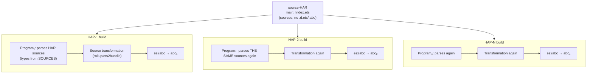
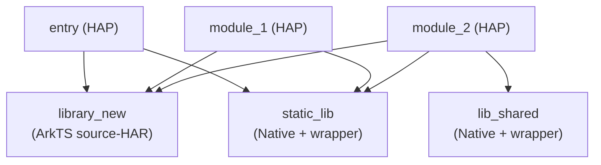
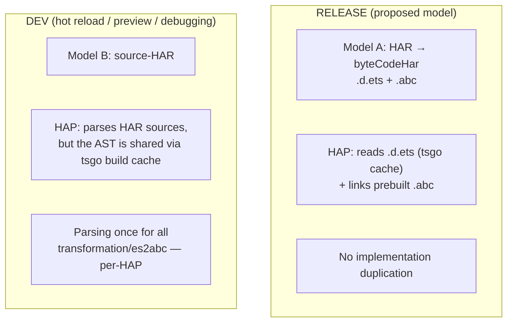

# Proposal: Sharing Implementation ASTs from HAR into HAP (hybrid mode)

> **Status:** proposal
> **Context:** moving ArkTS monorepo orchestration into tsgo; current pipeline —
> hvigor + ets2bundle + reference tsc + es2abc.
> **Date:** 2026-08-17

---

## 1. Summary (TL;DR)

1. **The default today is source-HAR, not byteCodeHar** (a HAR with prebuilt
   bytecode `.abc` + declarations `.d.ets`). HAR is shipped as sources
   (`main: Index.ets`, no `.d.ets`/`.abc`), and every HAP consumer **re-parses,
   re-binds, re-checks and re-transforms** the HAR sources in its own context.
   With N consumers, one `.ets` is processed N times (plus once in the HAR's own
   build — the HAP task depends on the HAR, so it always builds).

2. **Duplication at three levels:** (a) types — parsing/binding of sources in
   every consumer; checking partially (shared AST, but type table per Program);
   (b) transformation `.ets → .ts` — in every consumer;
   (c) bytecode — es2abc runs in every consumer's build.

3. **Proposal — hybrid mode:**
   - **Release builds (Model A):** HAR is built as byteCodeHar — `.abc` +
     `.d.ets`. The consumer reads declarations (cached by tsgo) and links the
     prebuilt bytecode. No implementation duplication (the consumer still
     parses and checks declarations — minor work).
   - **Dev builds (Model B):** HAR keeps being shipped as sources (hot reload,
     preview, debugging need sources), but implementation ASTs are **shared**
     between consumers through the extended tsgo build cache
     (`build.host.sourceFiles` — the build-wide parse cache, + RefCount + Hash).

4. **Model B is a deliberate compromise for dev builds**, not a replacement for
   Model A. Release always goes through declarations.

> **Premise of this document:** in the tsgo paradigm all build modules (HAR/HSP
> and HAP) are compiled **in a single orchestrator process** with a shared
> `build.host.sourceFiles` cache — unlike the current hvigor pipeline, where each
> module is a separate compilation with per-module caches (section 2.1). Without
> this premise, cross-module sharing is impossible by construction.

---

## 2. Current state: source-HAR by default

### 2.1 How source-HAR works (verified by code and a real project)

```
library_new/oh-package.json5:   (pure ArkTS source-HAR, no native part)
  "main": "Index.ets"        ← main file — SOURCE
  // no .d.ets, no .abc, no byteCodeHar
```

| Fact | Evidence |
|---|---|
| Local source-HAR does not produce `.d.ets` | **Code:** `.d.ets` generation for HAR lives only in the branch `if (projectConfig.compileHar && !projectConfig.byteCodeHar)` (`ets-loader/lib/fast_build/ets_ui/rollup-plugin-ets-typescript.js`, `afterBuildEnd` → `setIncrementalFileInHar` → `genTemporaryPath` from source). Local source modules (like `library_new`) do **not** go through `compileHar` when HAP consumers build — their `.d.ets` are not created. **Empirically:** `library_new/build/` contains only `module.json` |
| Consumer resolves sources in place | hvigor `getTscAddressPaths` → `paths: {"library_new/*": ["../library_new/src/main/ets/*"]}` |
| Each module is a separate program | per-module `.ts_checker_cache`, `.tsbuildinfo` (key `runtimeOS + sdkInfo`) |
| `.ets` are not copied | copy-plugin ignores `/\.ets$|\.ts$|\.js$/` — only resources are copied |
| es2abc runs in the consumer | for source-HAR, bytecode does not exist until the HAP build |

### 2.2 Why source is the default, not byteCodeHar

byteCodeHar (`.abc` + `.d.ets`) removes the duplication but is not used in
dev modes:

| Mode | Why HAR sources are needed |
|---|---|
| **Hot reload** | edits HAR sources on the fly → the consumer must see fresh code |
| **Preview** | the previewer works with sources |
| **Debugging** | sources + sourcemaps are more convenient; bytecode HAR is harder to debug |

That is why the ecosystem ships HAR as sources by default, accepting
duplication as the price of dev convenience.

### 2.3 What happens when a HAP with a source-HAR is built



One `.ets` from the HAR is processed **N+1 times** (parse+bind+check+transform):
once in the HAR's own build (the HAP task depends on the HAR, so it always
builds — whether that build parses the sources needs confirmation, see below) +
once in each of N HAP consumers. es2abc runs in each consumer only — it never
runs in the HAR's own build for a source-HAR. Concrete numbers for N=3 are in section 2.4.

### 2.4 Empirical verification (demo_project)

**Project composition** `demo_project` (build-profile.json5, 7 modules):

| Module | Type | Dependencies (`oh-package.json5`) |
|---|---|---|
| `entry` | HAP | `static_lib`, `library_new` |
| `module_1` | HAP | `static_lib`, `library_new` |
| `module_2` | HAP | `lib_shared`, `static_lib`, `library_new` |
| `library_new` | **ArkTS source-HAR** (4 `.ets`: `Index.ets`, `MainPage.ets`, `SecondPage.ets`, `BuildProfile.ets` — the latter is generated by hvigor and does not enter consumer programs, hence 3 reachable files) | — |
| `static_lib` | Native C++ HAR + ArkTS wrapper (`Index.ets`) | `libstatic_lib.so` (file:) |
| `lib_shared` | Native C++ HAR + ArkTS wrapper | `liblib_shared.so` (file:) |

Dependency graph:



Key scenario: **three HAPs import the same ArkTS source-HAR**:

```ts
// Index.ets of each of the three modules
import { MainPage } from "library_new"
```

Build-artifact check for all three modules after a full build:

| Level | entry | module_1 | module_2 | Duplication |
|---|---|---|---|---|
| **Program** (`.tsbuildinfo`) | 3 library_new files (`index.ets`, `mainpage.ets`, `secondpage.ets`) | 3 | 3 | **×3** — HAR sources in every consumer's program |
| **Transformation** (`compiler.cache/*.msgpack`) | 4 of 6 (Index×2, MainPage, SecondPage) | 4 of 6 | 4 of 6 | **×3** — each module transforms HAR sources again (the other 2 are its own EntryAbility/EntryBackup) |
| **TS copies** (`debug/library_new/*.ts`) | 3 (`Index.ts`, `MainPage.ts`, `SecondPage.ts`) | 3 | 3 | **×3** — transformed TS in each output |
| **Bytecode** (`intermediates/loader_out/*/modules.abc`) | 1 | 1 | 1 | **×3** — es2abc runs in each consumer |

**Conclusion (verified on a real project):** a source-HAR is fully recompiled
in every consumer — parsing, binding, checking, transformation and es2abc are
duplicated 3 times across consumers (once per HAP). The "+1 in the HAR's own
build" is asserted (the HAP task depends on the HAR) but not measured — it
needs confirmation whether the HAR's own build actually parses the sources
(the empirical table covers only consumer artifacts). Caches
(`compiler.cache`, `.tsbuildinfo`) are per-module and do not cover foreign sources.

### 2.5 HSP: the duplication problem does not apply

**HSP (Harmony Shared Package) is a fundamentally different type from
source-HAR:** it is already shipped as **prebuilt `.abc` + `.d.ets`** and works
per Model A (see section 4.1).

| | source-HAR | HSP |
|---|---|---|
| Dependency type | `har` | `hsp` |
| Distribution | `.ets` sources | `.abc` + `.d.ets` |
| Consumer resolution | paths → sources in place | **ohmurl**: `@bundle:bundleName/lib/ets/index` (`hspNameOhmMap`) |
| Build | `.d.ets` not generated (only under `compileHar`) | **generates `declare_file_output`** (`.d.ets`) as an artifact |
| Consumer parses the dependency's sources | ✅ **yes** — this is where the duplication comes from (section 2.3) | ❌ no — only `.d.ets` |

Code evidence:

```js
// ark-compile.js, declareOutputFiles: building an HSP emits declarations
if (!this.moduleModel.isHspModule() || ...)
    e.addEntry(path.resolve(this.aceModuleBuild, `../${DECLARE_FILE_OUTPUT}`), {isDirectory: true});

// ark_utils.ts: the consumer links HSP by ohmurl to bytecode
externalPkgMap = {...hspNameOhmMap, ...harNameOhmMap};  // "hsp" → "@bundle:.../ets/index"

// byte-code-har-utils.js: source handling applies to HAR only, HSP does not match
isSourceCodeHar = e => isHar(e) && !e.isByteCodeHarDependency();
```

**Consequence:** the whole problem and solution of this document concern
**source-HAR**. For HSP there is no duplication: the consumer does not parse its
sources, and `.d.ets` are cached between projects like ordinary declarations.
Implementation sharing is not needed for HSP.

---

## 3. The problem

With N HAPs using one source-HAR:

1. **CPU:** HAR parse/bind × N — repeated work; check × N fully (the type
   table is built per Program; after Model B it becomes partial — shared AST,
   but the type table stays per Program); transformation × N.
2. **Memory:** HAR implementation ASTs × N (one per consumer program);
   per-Program checker state (type table, LinkStore) × N.
3. **es2abc:** bytecode generated N times instead of once.
4. **Incrementality:** per-module `.tsbuildinfo` caches do not cover foreign
   sources — when the HAR changes, all N consumers need recompilation (their
   programs contain the HAR sources); exact incremental behavior needs a
   separate measurement.

For large projects (HAR with hundreds of `.ets`, 5–10 HAP consumers) time and
memory grow proportionally to the number of consumers for the dominant share
of work (parse/check).

---

## 4. Proposal: hybrid mode



### 4.1 Model A — release build (declarations)

Mechanics — classic project references (composite):

```
HAR build (tsgo):   .ets → parse/check → .d.ets (composite, mandatory)
                    es2abc → .abc          (invoked by tsgo orchestration)
HAP build:          reads .d.ets (build.host.sourceFiles — one AST for all)
                    + links .abc → es2abc does NOT run in the HAP
```

- Implementation sharing is **not needed** — the consumer sees only
  declarations (their parse/check is minor work, cached between projects).
- `.d.ets` are cached between projects: the `build.host.sourceFiles` filter uses
  `IsDeclarationFileName`, and `SupportedDeclarationExtensions` includes `.d.ets`
  (`internal/tspath/extension.go:27`) — so `.d.ets` already enter the shared
  declaration cache. This needs verification on a real ArkTS project (see the
  plan, step 12 — verification on demo_project).

> **Completeness of Model A** (unlike current hvigor): a release HAR must emit
> `.d.ets` **from tsgo** (the ETS declaration emitter is not ported to tsgo),
> the consumer must **detect byteCodeHar mode** (read `oh-package.json5`) and
> **skip es2abc** in its own build; the SDK versions of the HAR and the app must
> match (see risks, section 7). Without these steps Model A is not implementable
> — they are in the plan (section 8, steps 8–10).

### 4.2 Model B — dev builds (implementation sharing)

HAR keeps being shipped as sources, but the `.ets` implementation ASTs are
**shared** between consumer programs:

```
build.host.sourceFiles (now):  .d.ts/.json          — declaration cache
Model B (extension):           .d.ts/.json/.ets     — + implementations

HAP-1: GetSourceFile(library_new/Index.ets) → parse → store
HAP-2: GetSourceFile(library_new/Index.ets) → CACHE HIT (same AST)
HAP-3: GetSourceFile(library_new/Index.ets) → CACHE HIT
```

**Shared:** AST + symbols (bind results live in `SourceFile`).
**Not shared:** the checker's type table (per Program) and
transformation/bytecode. Transformation runs not in the compiler but in each
HAP's rollup context (bundling, tree-shaking, sourcemaps, obfuscation) — the
transformation code itself is deterministic (section 5.4, item 1), but the
whole stage lives in the consumer's build, so the AST cache does not cover it.

---

## 5. Implementing Model B in tsgo

### 5.1 Extending the build cache

```go
// build/host.go — current filter (only .d.ts/.json)
func (h *host) GetSourceFile(opts ast.SourceFileParseOptions) *ast.SourceFile {
    if tspath.IsDeclarationFileName(opts.FileName) || ... {
        return h.sourceFiles.loadOrStore(opts, h.host.GetSourceFile, false)
    }
    return h.host.GetSourceFile(opts)   // ← .ets bypasses the cache
}

// Model B: include .ets in the cache (behind a flag, not always)
```

### 5.2 Three cache upgrades (relative to the build cache)

The LSP `ParseCache` key already has Hash and ScriptKind; the build-mode key has
neither. The upgrades bring the build cache up to the LSP level:

| Upgrade | Why | Template |
|---|---|---|
| **Key + ScriptKind** | `.ets` is a separate script kind; add to the key | `ParseCacheKey` (LSP) |
| **Content hash** | hot reload/watch: a file changes between cycles → invalidation | `ParseCacheKey.Hash` (xxh3) |
| **RefCount** | free the AST when the last consumer is done | `RefCountCache` (LSP) |

### 5.3 Constraints and requirements

1. **AST mutability — already solved architecturally.** Unlike tsc JS (where
   `node.resolvedSymbol`/`resolvedType` are AST-node fields and the checker
   writes directly into the node), in tsgo per-node caches live outside the AST,
   in checker maps (`symbolNodeLinks`, `typeNodeLinks` —
   `LinkStore[*ast.Node, ...]`): each checker writes to **its own** maps. The
   remaining mutations are protected:
   - **bind** (Symbols, FlowNode) — `sync.Once` (`BindOnce`) — runs exactly
     once, concurrent callers wait;
   - **tokenCache / ECMALineMap** of the file — `sync.Mutex` / `sync.RWMutex`;
   - **FlowNode in synthetic nodes** — nodes created by `factory.New...`, not
     shared.

   **Consequence:** sharing `.ets` ASTs between Programs is safe by design —
   the same mechanisms as in the LSP. Caveat: in the LSP, cross-project
   sharing works for files with `EtsOptions == nil` (plain TS); for ArkTS
   files the pointer-keyed `EtsOptions` breaks cross-project hits in the LSP
   too — which is exactly why interning (step 1) is a mandatory prerequisite,
   not just a build-mode concern. For build mode with parallel workers
   (4 by default) a race test is needed (plan step 6) — but there are no
   fundamental blockers. Verifiable in code: `internal/checker/checker.go:667-668`
   (per-node LinkStore in the checker), `internal/ast/ast.go:2735-2740`
   (BindOnce, `sync.Once`), `internal/ast/ast.go:2502-2503` (tokenCacheMu),
   `internal/ast/ast.go:2496-2497` (ecmaLineMapMu).
2. **Cache key:** `SourceFileParseOptions` already contains options affecting
   the AST (ETS options, external-module indicator) — projects with different
   options get a cache miss and parse themselves. Safe automatically.
   **Exception — the `EtsOptions` pointer:** because Go compares pointers by
   address, a cache miss happens even with identical settings (see 5.4, item 3)
   — until interning, `.ets` sharing will not work.
3. **Enabling mode:** Model B is only for dev builds (hot reload, preview,
   debug). Release always goes through Model A (`.d.ets`).

### 5.4 etsOptions: globality, determinism, SDK key

**etsOptions are global for a build** (verified in code):

- Source — the SDK ets-loader: `ets-loader/tsconfig.json` (emitDecorators,
  propertyDecorators, render, styles, components, `customComponent`),
  plus `ets-loader/components/*/externalconfig.json` (external components).
- Per-module etsOptions are **not configurable** (there is no `ets` section in
  `build-profile.json5`). The SDK version is set once at the app level — all
  modules of one build compile with one SDK.
- In the tsgo paradigm, loading etsOptions is part of orchestration: tsgo must
  read the same SDK config (`ets-loader/tsconfig.json` + `externalconfig.json`),
  like the hvigor pipeline does today. The loading mechanics (where tsgo finds
  the SDK path) is a separate task, not detailed in this document.

**Consequences:**

1. **Within one build the HAR compiles deterministically** — all consumers get
   the same TS: etsOptions are identical for all modules → AST sharing is
   correct.
2. **SDK change → etsOptions change → recompilation** — already covered by the
   rollup cache key `getCompileEnv`:
   ```js
   [compileSdkVersion, compatibleSdkVersion, runtimeOS, etsLoaderPath,
    obfuscationEnable, moduleType, cachePath]
   ```
   An SDK change (etsLoaderPath or versions) → different key → cache miss →
   recompilation. For tsgo the same behavior will come from the
   `SourceFileParseOptions` key **after EtsOptions interning** (see item 3):
   a different SDK → different EtsOptions content → different keys →
   recompilation, and conversely — the same SDK → matching keys → sharing works.
3. **The `EtsOptions` pointer in the key** — a mandatory fix for Model B:
   `SourceFileParseOptions.EtsOptions` is `*core.EtsOptions`; Go compares
   pointers by address. Each project parses its own tsconfig → its own object →
   even identical content gives different addresses → cache miss → `.ets`
   sharing will not work. **Interning EtsOptions** (caching objects by content)
   or value comparison is required — otherwise implementation sharing is
   impossible even with identical settings.
4. **Source-HAR from oh_modules built with a different SDK version** — its
   sources are recompiled with the consumer's SDK → consistent with the rest
   of the build (no problem: it is compiled with the current SDK).

---

## 6. Expected effect

Example — the real case from section 2.4: **1 source-HAR (library_new, 3 `.ets`
in consumer programs: Index, MainPage, SecondPage) × 3 HAPs**
(entry, module_1, module_2):

| Metric | Now (source) | Model B (dev) | Model A (release) |
|---|---|---|---|
| Parse/bind `.ets` of HAR | 3× (in each HAP) | **1×** (cache) | 0× (only `.d.ets`) |
| Check (type table) | 3× | 3× (shared AST, but type table per Program) | 1× in the HAR build + consumer-side declaration check (minor work) |
| Implementation ASTs in memory | 3 copies | **1 copy** (+ per-Program checker state ×3) | 0 copies (only declaration ASTs, 1 for all) |
| Transformation `.ets → .ts` | 3× | 3× (not shared) | 1× (in the HAR build) |
| es2abc | 3× | 3× | **1×** (in the HAR build) |
| Hot reload | works | works | ❌ (needs source mode) |

Model B's real gain is **parsing, binding and AST memory**; checking saves
only on the shared AST (the type table stays per Program), transformation and
bytecode stay per-HAP (see 4.2). The table shows consumer-side work; the HAR's
own build adds another 1× to every row (the HAP task depends on the HAR). For
a HAR with hundreds of `.ets` and 5–10 consumers, parse and memory savings
grow proportionally to the number of consumers.

---

## 7. Risks

| Risk | Mitigation |
|---|---|
| Races on concurrent access to a shared AST | **Architecturally solved** (see 5.3 item 1): per-node caches in the checker's `LinkStore`, bind — `sync.Once`, file caches — mutexes. A race test for build mode with parallel workers remains (plan step 6) |
| Stale AST in watch/hot reload (file changed, cache old) | content hash in the key (like LSP) |
| **Memory can GROW** (N=1, baseline, leak on unbalanced Release) | detailed analysis in the plan §6 — measured in the benchmark (plan step 11) |
| **Is the HAR's own build really in the same process?** | open question — needs confirmation (plan §6) |
| **Who detects source vs byteCode HAR?** | a dependency-type detector is needed (plan §6) |
| Mixing Models A/B in one run | mode flag; release does not enable Model B |
| Symbols bound to the AST — bind shares with the AST | bind is idempotent (`sync.Once` + `file.isBound`), the checker only reads — verified |
| Transformation `.ets → .ts` stays per-HAP (not shared) | a deliberate Model B limitation — gain is only on parse/memory |
| **byteCodeHar: SDK-version mismatch between the HAR and the app** | `.abc` is compiled with the HAR's SDK; version mismatch — bytecode incompatible with the app. Requirement: SDK version alignment at release (as in current hvigor) — detailed in the separate Model A plan |
| **Cache key not canonicalized** (case, separators, symlink paths) | real example: `Index.ets` (oh-package) vs `index.ets` (tsbuildinfo) — without a case-stable key, sharing silently fails on Windows (like the EtsOptions pointer) |
| **byteCodeHar: SDK-version mismatch between the HAR and the app** | `.abc` is compiled with the HAR's SDK; version mismatch — bytecode incompatible with the app. Requirement: SDK version alignment at release (as in current hvigor) |
| **Cache key not canonicalized** (case, separators, symlink paths) | real example: `Index.ets` (oh-package) vs `index.ets` (tsbuildinfo) — without a case-stable key, sharing silently fails on Windows (like the EtsOptions pointer) |

---

## 8. Plan of work

> Steps 1–12 match the plan in `tsgo-har-ast-sharing-plan.md` (§5).
> Model A (steps 8–10) is detailed in a **separate plan** — listed here only as
> requirements (see §4.1).

| Step | Effort | Effect |
|---|---|---|
| **1. EtsOptions interning** (cache objects by content) | medium | **Prerequisite for step 2** — without it `.ets` sharing will not work (pointer in the key). Also affects the LSP `ParseCache` (same type in the key) — LSP tests needed |
| **2. Include `.ets` in `build.host.sourceFiles`** (behind a flag) | small | Implementation ASTs shared between consumers |
| 3. ScriptKind + hash in the cache key | medium | Correctness in watch/hot reload |
| 4. RefCount (modeled on `project.ParseCache`) | medium | Freeing; baseline stops growing |
| 5. **Key canonicalization** (case, separators, realpath) | medium | Without it sharing may silently fail on Windows (see risks) |
| 6. Race tests: parallel HAPs with a shared HAR | tests | Concurrency safety |
| 7. **Instrumentation** (Parsed/CacheHits/BindCount counters in `--verbose`) | small | Proves the sharing; input for E2E and the benchmark |
| 8. **Model A — `.d.ets` emission from tsgo** (ETS declaration emitter) | large | Without it Model A is not implementable — separate plan |
| 9. **Model A — byteCodeHar detection in the consumer + es2abc skip** | medium | Release without es2abc in consumers — separate plan |
| 10. **Model A — invoke es2abc from tsgo orchestration when building the HAR** | medium | Bytecode created once; SDK version alignment — separate plan |
| 11. **Build-mode flag** (dev/release, from orchestration `buildMode`; Model B only for dev) | small | Release isolated from dev mode |
| 12. **Benchmark before/after on demo_project** (time, peak, baseline, retained) | tests | Verify the claimed savings; capture baseline numbers before implementation |

---

## 9. Conclusions

1. **The default today is source-HAR**, and it is recompiled in every consumer —
   a verified fact (hvigor/ets2bundle code + a real project).
2. **The hybrid covers both scenarios:** release — byteCodeHar (`.d.ets` +
   `.abc`, no duplication); dev — source + implementation-AST sharing in the
   build cache.
3. **Implementation sharing is a narrow but legitimate improvement for dev
   builds**, not a replacement for declaration sharing. The release
   architecture (Model A) does not change.
4. Model B builds on existing tsgo mechanisms (`build.host.sourceFiles` + the
   LSP `ParseCache` as a template) — steps 1–7 are small/medium effort. Model A
   is larger: it needs `.d.ets` emission from tsgo, byteCodeHar detection and
   es2abc invocation (steps 8–10, separate plan).
5. The document relies on the premise of a single tsgo-orchestrator process
   with a shared cache; without it, cross-module sharing is impossible (see
   TL;DR).
