# Caching in a TypeScript Monorepo: How tsgo Builds 10 Projects Without Re-Doing Work

> This document explains how caching works during a monorepo build (`tsgo -b` / `tsc -b`):
> what is cached within a single project, what is shared across projects, what is
> destroyed after each project, what the cache keys are, and how to configure a
> monorepo so the caches actually hit. Includes a worked example of 10 projects
> sharing one SDK, with step-by-step diagrams of the shared cache filling up.

---

## 1. The Three Layers of Caching

During a monorepo build there are three distinct lifetimes for cached data:

| Layer | Lifetime | What lives there |
|---|---|---|
| **Per-project caches** | Born and destroyed with one project | Program, ASTs, symbol tables, type tables, module resolution cache |
| **Shared build caches** | Live for the whole build | Parsed `.d.ts`/`.json` files, extended tsconfigs, filesystem state |
| **On-disk caches** | Live between builds | `.tsbuildinfo` (incremental state), emitted `.d.ts`/`.js` outputs |

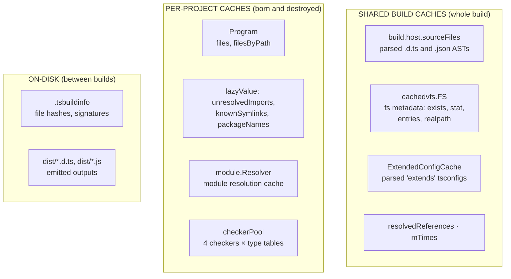

---

## 2. What Is Cached While Building ONE Project

When the build reaches project P, it runs the full pipeline **parse → bind → check → emit**.
Each stage creates data that lives only as long as P's `Program`:

| Cache | Where | Key | Destroyed when |
|---|---|---|---|
| `Program.files` / `filesByPath` | `compiler.Program` | path | P finishes |
| `unresolvedImports` | `lazyValue[Set]` | — (sync.Once) | P finishes |
| `knownSymlinks` | `lazyValue[KnownSymlinks]` | — (sync.Once) | P finishes |
| `packageNames` | `lazyValue[packageNamesInfo]` | — (sync.Once) | P finishes |
| `declarationDiagnosticCache` | `SyncMap[SourceFile, []Diagnostic]` | source file | P finishes |
| `moduleResolutionCache` | `SyncMap[key, *ResolvedModule]` | dir + module + mode + redirect | P finishes (resolver) |
| `typeResolutionsInFile` | `map[Path, ModeAwareCache]` | file path | P finishes (resolver) |
| **checkerPool** (4 checkers) | `compiler.checkerPool` | — | P finishes |
| **Type tables** | each `checker.Checker` | — | P finishes |

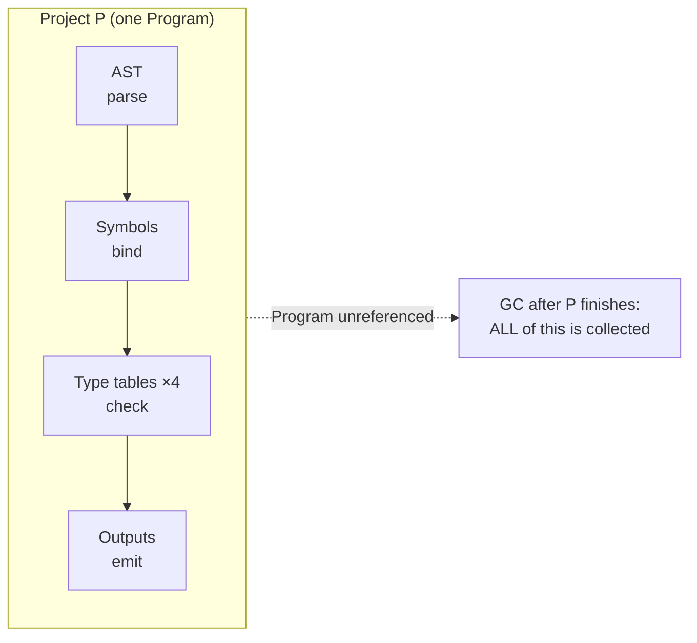

**Key point:** the whole pipeline output of one project — ASTs, symbols, type tables,
resolved modules — is garbage after the project is emitted. The next project starts
from zero **except** for the shared build caches below.

---

## 3. What Is Shared Between Projects

Only four structures survive across projects inside a single `tsgo -b` run:

| Shared cache | What it stores | Populated by |
|---|---|---|
| `build.host.sourceFiles` | Parsed ASTs of **`.d.ts` and `.json`** files | The first project that touches each file |
| `cachedvfs.FS` | **Filesystem metadata only**: `FileExists`, `DirectoryExists`, `GetAccessibleEntries`, `Stat`, `Realpath` | Any filesystem query |
| `ExtendedConfigCache` | Parsed tsconfigs reached via `extends` | Config parsing |
| `resolvedReferences` / `mTimes` | `ParsedCommandLine` of referenced projects, file mtimes | Graph building |

> **Note on file contents:** `cachedvfs.FS` caches metadata, not content. In build mode
> the *text* of a `.d.ts` is read once (at first parse) and then lives inside the
> `sourceFiles` AST cache — a cache hit never re-reads the file. (The LSP has a separate
> `SnapshotFS.diskFiles` cache that does store raw content.)

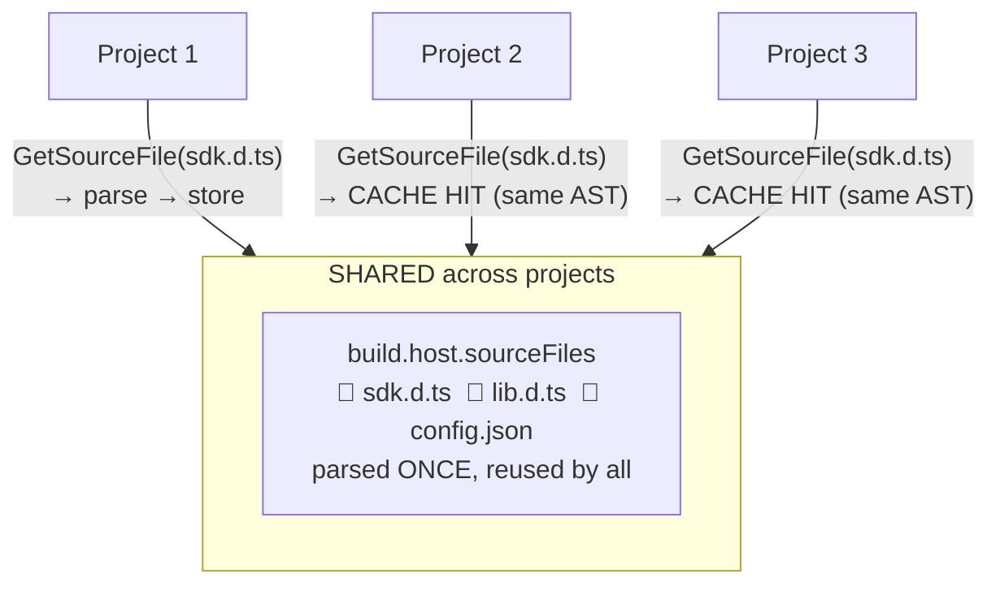

This is the single most important optimization in `tsgo -b`: **an SDK of 100 `.d.ts`
files is parsed exactly once**, no matter how many projects import it. (Plain
`tsc -b` has no such cache — every project re-parses every `.d.ts`.)

> ⚠️ **tsgo is ahead of tsc here.** The reference tsc shares nothing between projects
> in build mode; its `DocumentRegistry` sharing exists only in the Language Service.

---

## 4. Cache Keys: When Does Sharing Actually Hit?

### 4.1 The source-file cache key

`build.host.sourceFiles` is keyed by `ast.SourceFileParseOptions` (compared by value):

```go
type SourceFileParseOptions struct {
    FileName                       string              // absolute normalized path
    Path                           tspath.Path         // canonical path
    ExternalModuleIndicatorOptions // JSX, Force — always {} for .d.ts
    EtsAnnotationsEnable           core.Tristate       // ArkTS
    EtsCustomComponent             string              // ArkTS
    EtsOptions                     *core.EtsOptions    // ArkTS — POINTER!
    EtsLoaderPath                  string              // ArkTS
    NoTransformedKitInParser       core.Tristate       // ArkTS
}
```

### 4.2 What breaks the key (cache miss → re-parse)

| Factor | Why it breaks sharing |
|---|---|
| **Different paths to the same file** | key contains the resolved `FileName`. Symlinks with `preserveSymlinks: true`, duplicate package copies (`.pnpm/foo@1.0.0` vs `@1.0.1`), or casing differences → different keys |
| **ArkTS `EtsOptions`** | it is a **pointer**; Go compares pointers by address, not content. Two projects with identical `"ets": {...}` produce two objects → different keys → miss |
| **Changed file content (watch mode)** | content is not part of the key at all — a modified file would return the stale AST. Safe within a single run (files do not change); a hazard for `--watch`, which needs a content hash |
| **`ScriptKind`** | also not in the key, but derived from the file name → deterministic within one run, so it cannot diverge between projects |

### 4.3 What does NOT break the key

- **Different relative import spellings** — the resolver normalizes `../../projectC/src`
  and `../../../projectC/src` to the same absolute path → same key → sharing works.
- **Triple-slash references** — they affect how a file enters the program, not its AST.
- **`ExternalModuleIndicatorOptions`** — always empty for `.d.ts` files.

### 4.4 Symlinks: realpath is on by default — with one exception

```go
// internal/module/resolver.go:1155
if r.compilerOptions.PreserveSymlinks != core.TSTrue &&  // default: false → realpath ON
    isExternalLibraryImport &&        // path contains "/node_modules/"
    !tspath.IsExternalModuleNameRelative(r.name) {        // specifier is NOT "./x" or "../x"
    resolved.path = realpath(resolved.path)
}
```

- External package imports (`import "@scope/c"`) are **unwrapped to real paths** by
  default → they converge with relative imports onto the same cache key.
- **Exception:** relative imports *inside* node_modules (`import "./util"` within a
  package's own code) are NOT unwrapped. If a package's sources are compiled inside
  another program (JS package without `.d.ts`, `allowJs`), one physical file can land
  in the cache under two paths → duplicated AST.
- In a properly configured monorepo (composite + references) consumers only ever load
  `.d.ts` files, so this never happens.

### 4.5 The LSP analogue (for comparison)

The language-service `ParseCache` uses a stronger key — `(parseOptions, xxh3 content hash,
scriptKind)` — plus reference counting, so changed files invalidate and entries are freed
when the last project releases them. The build-mode cache has no hash and no refcount
yet — two natural upgrades if watch-mode correctness or cache eviction are ever needed.

---

## 5. How to Configure a Monorepo So Caches Hit

1. **Every referenced project must set `composite: true`** — the compiler enforces it
   (`TS6306`). `composite` implies `declaration` (enforced: *"Composite projects may not
   disable declaration emit"*), so every referenced project **always emits `.d.ts`**.
2. **Consumers import through references, never by copying files.** A file copied into
   two `include` sets is parsed twice — the exact duplication caching is meant to avoid.
3. **Use one resolution style per dependency.** Either package style (`@scope/c`, as in
   pnpm workspaces) or relative path style (`../projectC/src`), consistently. Realpath
   unwraps symlinks by default, but mixing styles invites edge cases.
4. **Keep parse options identical across projects** (shared `tsconfig.base.json`).
   The key includes ETS options — differing ArkTS settings split the cache.
5. **Put the SDK in `.d.ts` form** and let every project import it — the shared
   `sourceFiles` cache then parses it once for the whole build.

---

## 6. Worked Example: 10 Projects + One SDK

### 6.1 The dependency graph

- **SDK** — 100 `.d.ts` files (types only, never compiled, only parsed).
  Modeled as a pseudo-project for clarity: in a real repository it is either a
  referenced composite project, `@types` packages, or the bundled lib files. The
  mechanism is identical either way — the first access parses each file, every
  later access is a cache hit.
- **P1…P10** — TypeScript projects with the following dependencies:

```
P1  ← SDK
P2  ← P1, SDK
P3  ← P1, SDK
P4  ← P2, P3, SDK
P5  ← P2, SDK
P6  ← P4, SDK
P7  ← P3, SDK
P8  ← P5, P6, SDK
P9  ← P7, SDK
P10 ← P8, P9, SDK
```

**Diagram 1 — dependencies (arrow from a package to its dependency):**

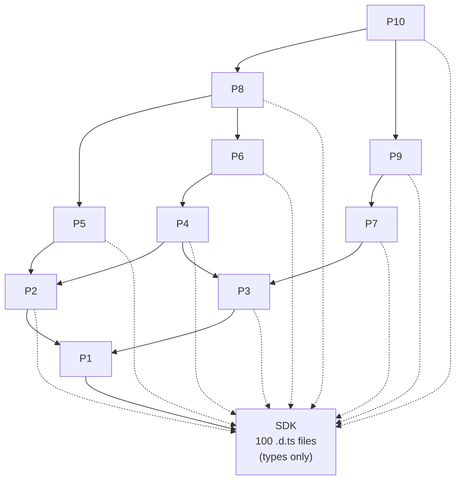

**Diagram 2 — compilation order (topological sort):**

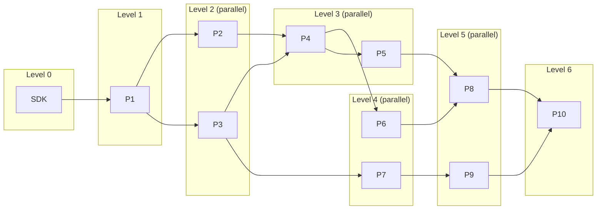

```
Build order: SDK → P1 → {P2, P3} → {P4, P5} → {P6, P7} → {P8, P9} → P10
Parallelism: projects on the same level build concurrently (up to --builders, default 4)
```

---

## 7. Step-by-Step: How the Shared Cache Fills Up

Legend for the following diagrams: the **shared cache** region shows which `.d.ts`
files have been parsed and stored. `📄` = file in cache. Projects read from the cache
(CACHE HIT) or parse into it (store). Only `.d.ts`/`.json` enter the shared cache;
each project's own `.ts` ASTs are per-project and die with it.

### Step 0 — before the build

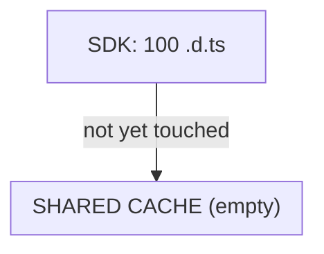

### Step 1 — the SDK's files are parsed first (on first access)

The SDK has no sources to emit; its 100 `.d.ts` are parsed **once** and stored.
In reality the files are parsed lazily by whichever project touches them first —
shown here as the first step for clarity.

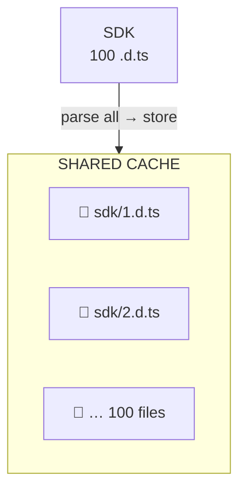

### Step 2 — P1 builds: cache hits on SDK, P1's own outputs enter the cache

P1's `src/*.ts` are parsed into its own Program (destroyed later). Its emitted
`dist/*.d.ts` enter the shared cache — they are what P2 and P3 will read.

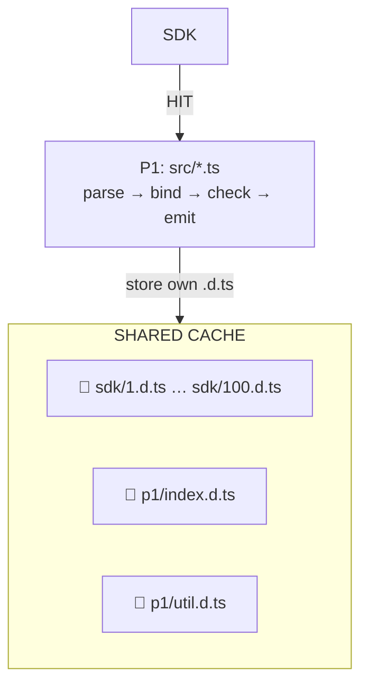

### Step 3 — P2 and P3 build in parallel: SDK and P1 are cache hits

Neither project re-parses the SDK nor P1's declarations — both come from the cache.
Their own `.d.ts` are appended.

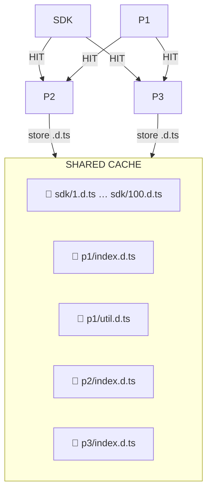

### Step 4 — P4 and P5 build (level 3)

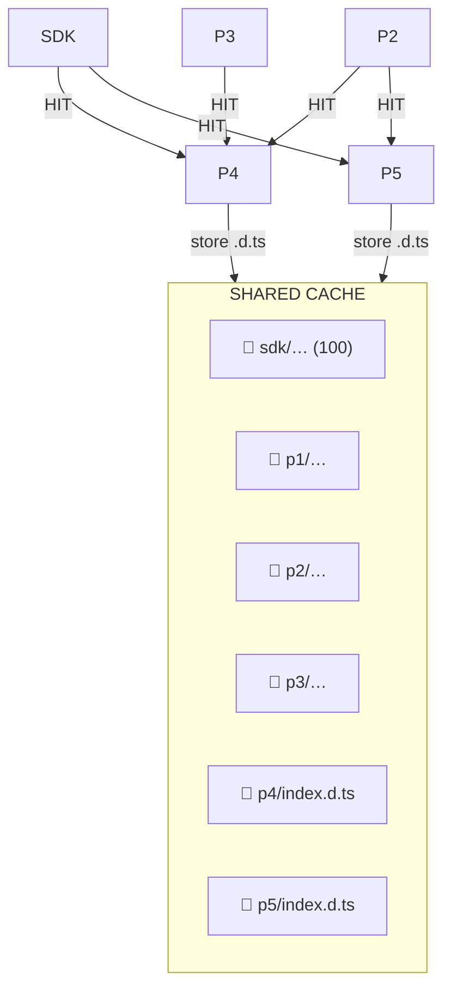

### Step 5 — P6 and P7 build (level 4)

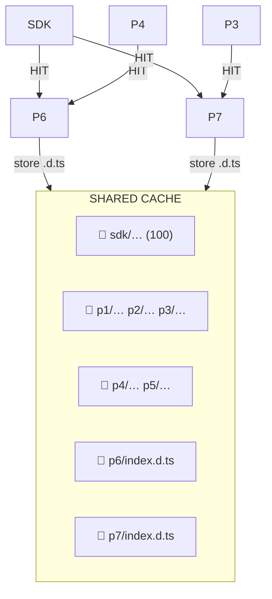

### Step 6 — P8 and P9 build (level 5)

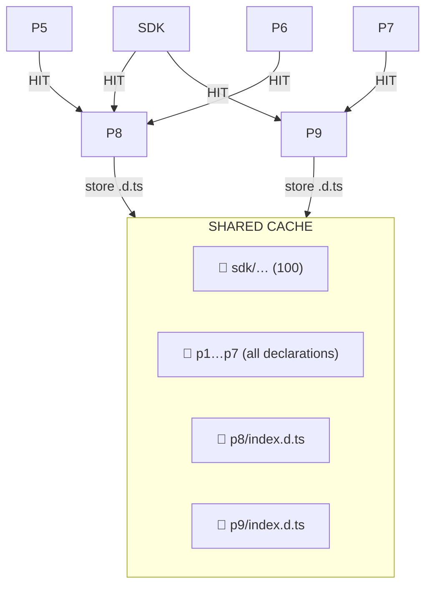

### Step 7 — P10 builds (level 6, the last one)

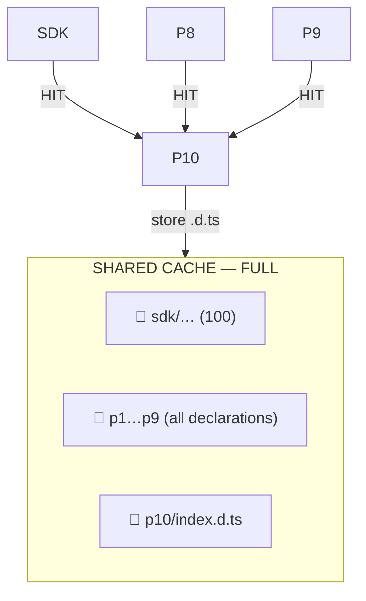

### After the build — memory accounting

Per-project data (ASTs, symbols, type tables, resolution caches) **never exists all at
once** — each project's copy lives only while that project is being built and is
collected immediately after its emit. At any moment at most one project's worth
(4 per level when parallel) is alive, alongside the growing shared cache:

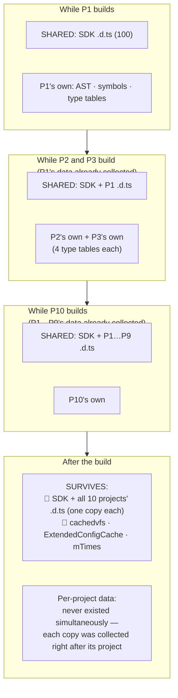

The peak memory during the whole build is bounded by **the shared cache (all `.d.ts`
ASTs, one copy each) + the largest single project's Program + its 4 type tables** —
not by the sum of all 10 projects.

---

## 8. Answer to the Original Task: "Expanding the Sharing Scope to Reduce Peak Memory"

> **Task statement:**
> Currently, tsgo's Parser only shares declaration files (`.d.ts`); each Program still
> independently holds the full AST and symbol table for implementation files. We should
> explore: under the constraint of disabling certain compiler options (e.g., turning off
> specific cross-file analysis capabilities), can we extend the sharing scope to the
> implementation file level? If feasible, this would fundamentally mitigate the linear
> memory growth problem under multi-Checker parallelism, and would be especially
> significant for large-scale projects.

**Short answer: in the current paradigm, extending sharing to implementation files
would not mitigate the problem — because implementation-file ASTs are not what grows
linearly.** The premise that "each Program independently holds the full AST and symbol
table for implementation files" is true but harmless in build mode: those Programs do
not live simultaneously. The actual source of the linear growth is the **type table**
per Checker, which AST sharing does not touch.

### 8.1 Why sharing implementation-file ASTs would not help in build mode

**1. Implementation files do not overlap between projects.**

A correctly configured monorepo (composite + references, no overlapping `include`)
assigns every file to exactly one project. There is nothing to share:

```
P1: src/a.ts        ─┐
P2: src/b.ts        ─┼─ every file belongs to one project → no duplicates
P3: src/c.ts        ─┘
```

Overlapping `include` sets are an anti-pattern (they produce `TS6307` and double
checking) — the fix is to correct the configs, not to build a cache for them.

**2. Per-project data dies immediately after the project — it never coexists.**

```
P1: [AST][bind][check][emit] → collected
P2:              [AST][bind][check][emit] → collected
```

At any moment at most **one** project's data is alive (4 under parallelism).
Duplicate ASTs between projects are physically impossible — the previous copy is
already garbage. Sharing requires two live owners; build mode never has them.

**3. The one real duplicate — the `.d.ts` SDK — is already shared.**

`build.host.sourceFiles` already solves the exact case the task names ("100+ `.d.ts`
SDK"): parsed once, reused by all projects. In a 12-package cold build this shared
cache alone accounts for roughly 450 MB of the peak heap — that *is* the working share.

**4. "Multi-Checker parallelism" duplicates type tables, not ASTs.**

Within one Program, all 4 Checkers share the **same** AST (`Program.files` is common).
What they duplicate is the **type table** — and extending AST sharing cannot help:

```
1 Program = 1 AST (shared by 4 checkers) + 4 type tables (duplicated)
                                                      ↑
                                     the real memory multiplier
```

**5. Where Programs do live simultaneously — LSP/API — implementation-file sharing
already exists.**

`project.ParseCache` (RefCountCache) shares **all** files (`.ts` + `.d.ts`) between
projects. The linear growth under multi-Checker parallelism in a long-running server
comes from type tables again, not from ASTs.

### 8.2 Where implementation-file sharing *would* pay off (and already does)

| Scenario | Would AST sharing help? |
|---|---|
| `-b`, non-overlapping projects | ❌ nothing to share |
| `-b`, overlapping `include` (anti-pattern) | ✅ but fix the configs instead |
| `-b --watch` (between cycles) | ✅ re-parses unchanged files between cycles — partially mitigated by `.tsbuildinfo` and mtime tracking; a content-hashed cache would help but is not implemented in build mode |
| LSP / API (many live Programs) | ✅ **already implemented** via `ParseCache` |

### 8.3 A possible area for new research

We can research of possibility to improve the stage that actually multiplies memory consumption: 
**"share the type-table region for SDK (`.d.ts`) files across Checkers within and across Programs"**. 
That is where the linear growth under multi-Checker parallelism comes from, and it is the change that
would matter for large-scale projects. The "disable certain compiler options" idea
applies there naturally: an immutable, pre-initialized SDK type region requires the
type-affecting options (strictness flags, `skipLibCheck`, …) to be identical across
the projects that share it.

---

## 9. Summary

| Question | Answer |
|---|---|
| What is cached per project? | ASTs, symbols, type tables, module resolution — dies with the Program |
| What is shared between projects? | `.d.ts`/`.json` ASTs (`build.host.sourceFiles`), `cachedvfs`, `ExtendedConfigCache`, `resolvedReferences`, `mTimes` |
| What survives the build? | The shared cache; `.tsbuildinfo` and emitted outputs live on disk for the next run |
| Cache key | `SourceFileParseOptions` (path + external-module indicator + ArkTS options) |
| What breaks sharing | Different paths to one file, ArkTS pointer options, mixed import styles under `preserveSymlinks: true` (realpath converges by default) |
| What does NOT break sharing | Different relative spellings, triple-slash references |
| How to set up | `composite: true` everywhere, references from package deps, one import style, identical parse options, SDK as `.d.ts` |
| Is it advisable to share the AST of TS files? | **No** - for a correctly configured monorepo |
